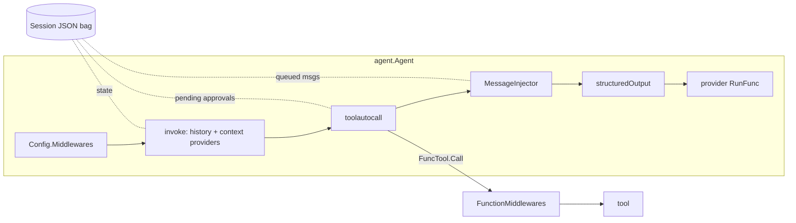
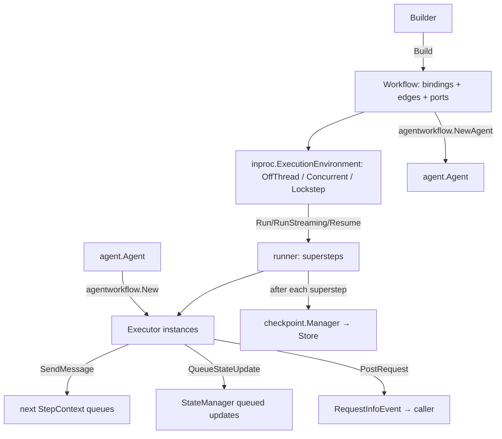

# Microsoft Agent Framework for Go: Source Analysis

- **Repository:** `github.com/microsoft/agent-framework-go`, checked out at `~/git/lib/agent-framework-go`
- **Commit analyzed:** `425452cf06198c67b542491ae3fdd98203ba192b` (2026-09-25, "Add .NET-to-Go symbol map and weekly audit (#1186)"). The history has 849 commits, starting 2025-10-25.
- **Module:** `github.com/microsoft/agent-framework-go`, `go 1.26.0` (`go.mod`)
- **Purpose:** inform API and runtime design for Dive.

All paths below are relative to the repo root. Line numbers refer to the commit above.

---

## 1. Overview

### What it is

This is Microsoft Agent Framework (MAF) for Go. The package docs and headers confirm it: every file carries `// Copyright (c) Microsoft. All rights reserved.`, and the module path is `github.com/microsoft/agent-framework-go`. It is a Go port of the .NET and Python MAF, which grew out of Semantic Kernel and AutoGen. The porting is explicit and ongoing:

- `docs/dotnet-go-sdk-symbol-mapping.json` and `docs/dotnet-sdk-symbol-inventory.json` map each .NET type and member to a Go symbol. There is also a weekly audit.
- `cmd/dotnetsymbols` extracts .NET symbols, `cmd/symbolmap` reconciles them against a Go index, and `cmd/verifyexamples` runs the samples.
- Comments cite .NET behavior as the spec throughout. Examples: `agent/response.go:78` ("matching .NET's ChatMessage list ConcatText"), `agent/agent.go:212` ("matching the .NET clear-on-conflict semantics"), `agent/harness/toolautocall/autocall.go:393` ("matching .NET's FunctionInvokingChatClient"), and `workflow/workflow.go` (`CheckOwnership`: "matching .NET's reference-token ownership model").

### Philosophy (as seen in the code)

1. **The agent is a streaming function pipeline.** An `*agent.Agent` wraps a provider `RunFunc` that returns `iter.Seq2[*ResponseUpdate, error]`. History, context providers, the tool loop, structured output, logging and telemetry are all layered on as middleware or lifecycle hooks around that one function type (`agent/agent.go:20-23`, `agent/middleware.go:30-32`).
2. **Providers build agents; there is no separate chat-client interface.** In .NET MAF, an `AIAgent` sits on top of MEAI's `IChatClient`. In Go the two are merged: every provider package exposes `NewAgent(...) *agent.Agent` and installs the tool loop as provider middleware (`provider/anthropicprovider/agent.go:58-78`).
3. **Tool calling, approvals, and human input are message content, not control flow.** Pausing a run for approval means ending it and returning a `*message.ToolApprovalRequestContent`. The caller resumes by calling `Run` again with a `*message.ToolApprovalResponseContent`. Bookkeeping is stored in a JSON-serializable `*agent.Session`.
4. **A separate, heavy workflow engine.** `workflow` is a Pregel/BSP-style graph engine with typed message routing, supersteps, scoped state, checkpoints and request ports (the HITL mechanism). Agents are adapted in both directions: an agent can be an executor, and a workflow can be an agent (`workflow/agentworkflow`).
5. **Broad reach across the ecosystem.** Providers cover OpenAI (Chat Completions and Responses), Anthropic, Gemini, Azure Foundry, the GitHub Copilot SDK, A2A and AG-UI. MCP works in both directions, as client and server. OTel GenAI semantic conventions are included.

### Repo layout (non-test, non-example Go code)

| Path | Role | Size |
|---|---|---|
| `agent/` | Core `Agent`, `Session`, `Middleware`, `Option`, `Response`/`ResponseUpdate`, history/context providers, structured output, message injection, continuation tokens | ~2.3k LOC |
| `agent/harness/toolautocall` | The actual function-calling loop (a middleware) | 1,586 LOC |
| `agent/harness/{toolapproval,loop,todo,agentmode}` | "Harness" features: approval rules, a Ralph-style re-invocation loop, todo tools, plan/execute mode | ~1.9k LOC |
| `agent/compaction` | Message grouping plus compaction strategies (sliding window, truncation, tool-result collapse, summarization) as a `ContextProvider` | ~1.5k LOC |
| `agent/skills`, `agent/skills/fsskills` | Agent Skills (`SKILL.md`) provider | ~1.6k LOC |
| `agent/format/jsonformat` | JSON Schema from Go types (`google/jsonschema-go`), validation and normalization | ~230 LOC |
| `message/` | `Message`, sealed `Content` union (~20 content types), annotations, filters, message-workflow executor helpers | ~2.3k LOC |
| `tool/` | `Tool`, `SchemaTool`, `FuncTool`, `ApprovalRequiredTool`; `functool` (generic typed tools), `agenttool`, `mcptool`, `hostedtool`, `shelltool` | ~2.9k LOC |
| `provider/*` | openai (chat and responses), anthropic, gemini, foundry, copilot, a2a (client and server), agui (client and server), otel middleware | ~9k LOC |
| `workflow/` | Graph builder, `Executor`, routing, edges, request ports, `PortableValue`, type identity | ~4.3k LOC |
| `workflow/inproc`, `workflow/internal/execution` | In-process superstep runner, event streams, state manager, edge runner, subworkflows | ~4.5k LOC |
| `workflow/checkpoint` | `Manager`, `Store[T]`, in-memory and file-system JSON stores | ~600 LOC |
| `workflow/agentworkflow` | Agent-as-executor hosting, workflow-as-agent, sequential/concurrent/group-chat builders | ~3.1k LOC |
| `internal/azaiprojects` | Generated Azure AI Projects client | ~23k LOC (generated) |

Tests: 133 `_test.go` files, about 80k LOC. That is roughly 2x the hand-written production code, and the suite is heavy on behavioral-parity cases.

---

## 2. Core packages and Go types

### 2.1 `agent`: the provider function and the agent

```go
// agent/agent.go:20-23
// RunFunc is the provider function that executes an agent invocation.
// Implementations must treat the message and option slices, and existing
// messages, as read-only. Clone them before making changes.
type RunFunc = func(ctx context.Context, messages []*message.Message, options ...Option) iter.Seq2[*ResponseUpdate, error]
```

```go
// agent/agent.go:25-60
type ProviderConfig struct {
	ProviderName string
	Run RunFunc
	Middlewares []Middleware          // wrap Run after history/context providers
	ManagesToolExecution bool         // provider (e.g. Copilot) executes FuncTools itself
	Format func(v any) (ResponseFormat, error)
	Unmarshal func(format ResponseFormat, data []byte, v any) error
	CreateSession func(ctx context.Context, session *Session, options ...Option) error
	ServiceDoesNotManageHistory bool  // e.g. AG-UI
}
```

```go
// agent/agent.go:62-119 (abridged)
type Config struct {
	ID, Name, Description string
	HistoryProvider HistoryProvider
	ThrowOnHistoryProviderConflict *bool   // default true
	WarnOnHistoryProviderConflict  *bool   // default true
	ClearOnHistoryProviderConflict *bool   // default true
	ContextProviders []ContextProvider
	Logger *slog.Logger
	LogSensitiveData bool
	DisableRunLogs bool
	Middlewares []Middleware                         // wrap the whole run (outside history)
	FunctionMiddlewares []FunctionInvocationMiddleware // wrap each tool call
	MessageInjector *MessageInjector
	Tools []tool.Tool
	RunOptions []Option
}

func New(prov ProviderConfig, cfg Config) *Agent  // panics if prov.Run == nil
```

`*Agent` exposes `Run`, `RunText`, `RunMessage` (each returns `ResponseStream`), `CreateSession`, and `ID/Name/Description/ProviderName` (`agent/agent.go:230-298`). `AgentFromContext(ctx)` retrieves the running agent for middleware (`agent/agent.go:625-632`).

### 2.2 Streaming result types

```go
// agent/response.go:15-29
type ResponseStream iter.Seq2[*ResponseUpdate, error]
func (r ResponseStream) Collect() (*Response, error)
```

```go
// agent/response.go:277-320
type ResponseUpdate struct {
	RawRepresentation    any `json:"-"`
	AdditionalProperties map[string]any
	AgentID, MessageID, ResponseID string
	FinishReason         string
	AuthorName           string
	Role                 message.Role
	ContinuationToken    string
	CreatedAt            time.Time
	Contents             message.Contents
}
```

`Response` (`agent/response.go:37-68`) is the folded form: `Messages []*message.Message` plus response-level ID, FinishReason, ContinuationToken and RawRepresentation. `Response.Update` merges an update into the last message unless the `MessageID`, `Role` or `AuthorName` differ (`isDifferentMessage`, `agent/response.go:260-264`). This is exactly the MEAI `ChatResponseUpdate` coalescing model. Usage is not a field. It travels as `*message.UsageContent` inside `Contents` and is summed by `Response.Usage()` (`agent/response.go:110-119`).

### 2.3 Middleware, function middleware, options

```go
// agent/middleware.go:30-41
type Middleware interface {
	Run(next RunFunc, ctx context.Context, messages []*message.Message, options ...Option) iter.Seq2[*ResponseUpdate, error]
}
type MiddlewareFunc func(next RunFunc, ctx context.Context, messages []*message.Message, options ...Option) iter.Seq2[*ResponseUpdate, error]
```

```go
// agent/middleware.go:44-81
type FunctionInvocationContext struct {
	Function  tool.FuncTool
	CallID    string
	Arguments string // raw JSON; middleware may replace before calling next
}
type FunctionInvocationMiddleware func(
	next func(context.Context, *FunctionInvocationContext) (any, error),
	ctx context.Context, invocation *FunctionInvocationContext) (any, error)
```

Options form an open interface identified by concrete type, with reflection-based lookup:

```go
// agent/options.go:19-21, 58-68
type Option interface {
	MAFValue() any
}

func GetOption[T any](opts []Option, setter func(T) Option) (T, bool) {
	var zero T
	setterType := reflect.TypeOf(setter(zero))
	for _, opt := range slices.Backward(opts) {   // last wins
		if reflect.TypeOf(opt) == setterType { ... }
	}
}
```

Built-in options: `WithSession`, `WithTool`, `WithToolMode`, `Stream(bool)`, `WithInstructions`, `WithResponseFormat`, `WithStructuredOutput(&v)`, `WithContinuationToken`, `AllowBackgroundResponses`, `WithServiceID` (`agent/options.go:99-171`). Providers add their own: `anthropicprovider.MessageNewParams(anthropic.MessageNewParams)` passes raw SDK params through (`provider/anthropicprovider/agent.go:31-37`), and OpenAI and Gemini have equivalents.

### 2.4 Session: a serializable state bag

```go
// agent/session.go:25-29
type Session struct {
	serviceID string
	state map[string]*stateValue
}
func (s *Session) Get(key string, value any) (bool, error)
func (s *Session) Set(key string, value any)
func (s *Session) Delete(key string)
func (s *Session) ServiceID() string
func (s *Session) SetServiceID(id string)
// + MarshalJSON / UnmarshalJSON
```

`stateValue` (`agent/value.go:14-82`) is a well-designed piece. It holds either a live Go value or raw JSON. It decodes lazily into the type the caller asks for, caches by `reflect.Type`, and re-emits the original raw JSON on marshal when it has one, so unread fields are never lost (`agent/value.go:60-74`). Everything stateful uses this one bag: in-memory history, pending approvals, auto-approved calls, injected messages, todo lists and agent mode. The session is not internally synchronized. Only the in-memory history provider takes a per-session lock, via a `weak.Pointer`-keyed `sync.Map` (`agent/history.go:199-220`).

### 2.5 History and context providers

```go
// agent/history.go:42-48
type HistoryProvider interface {
	Invoking(context.Context, InvokingContext) ([]*message.Message, error)
	Invoked(context.Context, InvokedContext) error
}
```

```go
// agent/context.go:39-45, 53-77
type ContextProvider interface {
	Invoking(context.Context, InvokingContext) ([]*message.Message, []Option, error)
	Invoked(context.Context, InvokedContext) error
}
type InvokingContext struct { Messages []*message.Message; Options []Option }
type InvokedContext  struct { RequestMessages, ResponseMessages []*message.Message; Options []Option; Err error }
```

`NewHistoryProvider` and `NewContextProvider` take a config with `Provide` and `Store` callbacks plus message filters. Their defaults source-stamp injected messages (`message.Source{Type, ID}`) so that later filters can exclude them from storage (`agent/history.go:78-155`, `agent/context.go:108-191`). Only a context provider can add options, which means tools and instructions. The todo, agentmode, skills and shelltool environment packages all use this to inject tools and instructions per run.

### 2.6 `message`: a sealed content union

```go
// message/message.go:41-50
type Message struct {
	AdditionalProperties map[string]any
	Contents             Contents
	Role                 Role      // user | assistant | system | tool
	ID                   string
	AuthorName           string
	Source               Source    // provenance: external, history-provider, context-provider, middleware
	CreatedAt            time.Time
	RawRepresentation    any `json:"-"`
}
```

```go
// message/content.go:53-100
type contentKind string   // unexported => sealed
type ContentHeader struct {
	AdditionalProperties map[string]any
	Annotations          Annotations
	RawRepresentation    any `json:"-"`
}
type Content interface {
	json.Marshaler
	kind() contentKind
	Header() *ContentHeader
}
type ToolCallContent interface { Content; GetCallID() string }
type ToolResultContent interface { Content; GetCallID() string }
type InputRequestContent interface { Content; GetRequestID() string }
type InputResponseContent interface { Content; GetRequestID() string }
```

The concrete types are Text, TextReasoning (with `ProtectedData` for signatures and encrypted reasoning), Data, URI, HostedFile, HostedVectorStore, Error, Usage, FunctionCall, FunctionResult, ToolApprovalRequest, ToolApprovalResponse, AlwaysApproveToolApprovalResponse, and MCPServer, CodeInterpreter, ImageGeneration and WebSearch call/result types. Unknown kinds unmarshal to `*RawContent` (`message/content.go:104-120`), which gives forward compatibility.

```go
// message/content.go:403-410, 458-463
type FunctionCallContent struct {
	ContentHeader
	Arguments         string   // raw JSON string
	CallID            string
	Error             error    // mapping error; not serialized
	Name              string
	InformationalOnly bool     // "already handled; don't invoke"
}
type FunctionResultContent struct {
	ContentHeader
	CallID string
	Error  error  // not serialized (MarshalJSON drops it)
	Result any
}
```

### 2.7 `tool`: a capability-interface ladder

```go
// tool/tool.go:61-95
type Tool interface {
	Name() string
	Description() string
}
type SchemaTool interface {
	Tool
	Schema() any
	ReturnSchema() any
}
type FuncTool interface {
	SchemaTool
	Call(ctx context.Context, args string) (any, error)
}
type ApprovalRequiredTool interface {
	Tool
	ApprovalRequired() bool
}
func ApprovalRequiredFunc(t FuncTool) FuncTool
```

A bare `Tool` is a hosted-tool marker, such as `hostedtool.WebSearch`, `FileSearch`, `CodeInterpreter` or `MCPServer` (`tool/hostedtool/hostedtool.go`). A `SchemaTool` that is not a `FuncTool` is a declaration only: the model can call it, but the loop stops and hands the call back to the caller (`autocall.go:614-619`). `ToolMode` is a string with `auto`, `required`, `none` and `required:<name>` (`tool/tool.go:10-59`).

### 2.8 `workflow`: graph engine types

```go
// workflow/executor.go:31-90 (abridged)
type Executor struct {
	ID string
	ImplementationID string
	AutoSendMessageHandlerResultObject *bool  // default true
	AutoYieldOutputHandlerResultObject *bool  // default true
	CrossRunShareable bool
	ConfigureProtocol func(builder *ProtocolBuilder) (*ProtocolBuilder, error)
	InitializeFunc func(ctx *Context) error
	AttachRuntimeFunc func(runtime any) error
	ResetFunc func() error
	CloseFunc func(ctx context.Context) error
	OnCheckpointFunc func(ctx *Context) error
	OnCheckpointRestoredFunc func(ctx *Context) error
	OnMessageDeliveryStartingFunc func(ctx *Context) error
	OnMessageDeliveryFinishedFunc func(ctx *Context) error
	state executorState
}
```

```go
// workflow/binding.go:19-63 (abridged)
type ExecutorBinding struct {
	ID, ImplementationID string
	RawValue any
	SharedInstance bool
	SupportsConcurrentSharedExecution bool
	Ports []RequestPort
	NewExecutorFunc func(sessionID string) (*Executor, error)
	ResetFunc func() bool
}
```

```go
// workflow/workflow.go:516-576 : the per-invocation executor API
type Context struct {
	context.Context
	AddEvent         func(event Event) error
	SendMessage      func(targetID string, message any) error   // delivered next superstep
	YieldOutput      func(output any) error
	RequestHalt      func() error
	PostRequest      func(request *ExternalRequest) error       // HITL
	ReadState        func(key string, scope string) (any, error)
	ReadOrInitState  func(key, scope string, initFunc func(ctx context.Context, key, scope string) (any, error)) (any, error)
	ReadStateKeys    func(scope string) iter.Seq2[string, error]
	QueueStateUpdate func(key string, scope string, value any) error  // published at barrier
	QueueClearScope  func(scope string) error
	TraceContext     func() map[string]any
	ConcurrentRunsEnabled bool
}
```

```go
// workflow/requestport.go:14-45
type RequestPort struct { ID string; Request, Response reflect.Type }
type ExternalRequest  struct { PortInfo RequestPortInfo; RequestID string; Data PortableValue }
type ExternalResponse struct { PortInfo RequestPortInfo; RequestID string; Data PortableValue }
```

```go
// workflow/checkpoint/store.go
type Store[T any] interface {
	CreateCheckpoint(ctx context.Context, sessionID string, data T, parent *workflow.CheckpointInfo) (workflow.CheckpointInfo, error)
	RetrieveCheckpoint(ctx context.Context, sessionID string, info workflow.CheckpointInfo) (T, error)
	RetrieveIndex(ctx context.Context, sessionID string, withParent *workflow.CheckpointInfo) ([]workflow.CheckpointInfo, error)
}
```

`checkpoint.Manager` is sealed through an unexported `internal()` method (`workflow/checkpoint/manager.go:17-24`). There are only two constructors: `NewInMemoryManager()` and `NewJSONManager(Store[json.RawMessage])`. `FileSystemJSONStore` is the only shipped durable store.

Builder API (`workflow/builder.go`): `NewBuilder(start)`, `AddEdge(src, dst, opts...)`, `AddFanOutEdge`, `AddFanInBarrierEdge`, `AddChain`, `AddSwitch(...).AddCase(...).WithDefault(...)`, `WithOutputFrom`, `WithIntermediateOutputFrom`, `Build()`. Edge options include `WithEdgeCondition[T]`, `WithEdgeAssigner[T]` (fan-out partitioning), `WithEdgeLabel` and `IdempotentEdge` (`workflow/edge.go:19-78`).

`NewExecutor(id, v any)` builds an executor by reflection from a function `func([*Context,] In) (Out, error)` or from a struct with a `Handle` method. Marker fields `AttrSendsMessage[T]` and `AttrYieldsOutput[T]` declare extra protocol types (`workflow/executor.go:822-910`).

---

## 3. Key concepts and how they relate

### 3.1 Agent-side composition

```
Agent.Run(ctx, msgs, opts...)
 │ prepareRun: prepend Config.RunOptions (tools, instructions, function-middleware wrapper);
 │             auto-create a per-run Session if none given; ctx += agent            (agent.go:571-613)
 ▼
runPipeline = [runLogger?] + Config.Middlewares  ─►  a.invoke                       (agent.go:143-146,195)
                                                     │
      HistoryProvider.Invoking  (prepend history)    │                               (agent.go:324-333)
      ContextProviders[i].Invoking (msgs + options)  │                               (agent.go:335-345)
                                                     ▼
providerPipeline = ProviderConfig.Middlewares (toolautocall) → MessageInjector → structuredOutput → provider RunFunc
                                                     │                               (agent.go:147-194)
      stream updates to caller, fold into Response   │                               (agent.go:373-407)
      HistoryProvider.Invoked(request, response, err)│                               (agent.go:424-449)
      ContextProviders[i].Invoked(...)               ▼                               (agent.go:451-468)

FunctionMiddlewares wrap each FuncTool through an internal `toolmiddleware.Wrapper` Option,
applied when toolautocall builds its tool map (autocall.go:624-658, agent.go:132-137).
```

Middleware ordering is "first registered is outermost" (`compileRunChain`, `agent/middleware.go:148-159`). The history and context hooks run once per `Agent.Run`, outside the tool loop. The tool loop runs inside, as provider middleware.



### 3.2 Workflow-side composition



The bridges between the two halves:

- **Agent as executor.** `agentworkflow.New(a, cfg) workflow.ExecutorBinding` (`workflow/agentworkflow/hosting.go:116-133`). Incoming `[]*message.Message` values are buffered until a `workflow.TurnToken` arrives, then the agent runs. `ToolApprovalRequestContent` and unterminated `FunctionCallContent` are turned into workflow `ExternalRequest`s through two auto-created request ports, `<id>_UserInput` and `<id>_FunctionCall` (`hosting.go:139-156`). The agent `Session` is JSON-serialized into executor state in `OnCheckpoint` (`hosting.go:224-244`).
- **Workflow as agent.** `agentworkflow.NewAgent(wf, cfg) (*agent.Agent, error)` (`workflow/agentworkflow/workflow.go:84`). The `providerState` lives in the agent `Session`. It holds the workflow session ID, the last checkpoint, the pending external requests, and an in-session checkpoint store, so an agent session can resume a workflow in a new process (`workflow/agentworkflow/session.go:124-180`).
- **Agent as tool.** `agenttool.New(a, cfg)` gives a `{query: string}` schema and returns `resp.String()` (`tool/agenttool/agenttool.go`).
- **Agent as protocol server.** `a2aprovider.NewExecutor` (A2A server), `aguiprovider.NewJSONHTTPHandler` (AG-UI), and `mcptool.AddTool` (expose a `FuncTool` on an `mcp.Server`).

### 3.3 Concept glossary

| Concept | Go type | Notes |
|---|---|---|
| Agent | `*agent.Agent` | Concrete struct with no interface. Built by provider constructors. |
| Chat client / model | *(none)*; the provider `RunFunc` | The model call and the agent are fused. |
| Thread / session | `*agent.Session` | JSON-serializable state bag plus `ServiceID` for server-side conversations. |
| Memory / RAG | `ContextProvider` | For example `foundryprovider.NewMemoryProvider`. Runs once per `Run`. |
| History | `HistoryProvider` | Defaults to in-memory stored inside the Session. Turned off when the service manages history. |
| Middleware | `agent.Middleware`, `FunctionInvocationMiddleware` | Stream-transformers over `iter.Seq2`. |
| Tool loop | `toolautocall.New(cfg)` middleware | Installed by each provider constructor. |
| Workflow | `*workflow.Workflow` | Immutable graph plus an ownership token. |
| Executor | `*workflow.Executor` / `ExecutorBinding` | Node behavior vs. registration and instantiation policy. |
| Checkpoint | `workflow.CheckpointInfo{SessionID, CheckpointID}` | Taken after every superstep. |
| HITL | `ToolApprovalRequestContent` (agents), `RequestPort`/`ExternalRequest` (workflows) | Both are "end the run, resume with a response" designs. |

---

## 4. Execution, durability, and guarantees

### 4.1 Agent runs

- **Laziness.** `Agent.Run` does only preparation, then returns an iterator (`agent/agent.go:292-298`). No goroutines are started. The provider call happens when the caller ranges over the stream, and breaking out of the range stops the work, because the SDK stream is closed by `defer stream.Close()` in providers (`provider/anthropicprovider/agent.go:132-134`). There is no background execution and no event bus.
- **Streaming vs. non-streaming** is a run option, `agent.Stream(true)`. Non-streaming providers yield one big update (`provider/anthropicprovider/agent.go:99-130`). `Collect()` gives the same `*Response` either way.
- **Concurrency.** A shared `*Agent` is safe for concurrent runs. Mutable agent-level state is limited to `historyCleared atomic.Bool` (`agent/agent.go:212-216`). A `*Session` is not safe to share across concurrent runs, apart from the in-memory history lock. Tool calls are serial unless `toolautocall.Config.AllowConcurrentInvocations` is set, in which case there is one goroutine per call joined with a `sync.WaitGroup` and no concurrency cap (`autocall.go:1062-1092`).
- **Persistence.** Only through the Session. History is stored after a successful run. The default providers skip `Store` when `InvokedContext.Err != nil` (`agent/history.go:133-135`, `agent/context.go:169-171`). If the consumer stops iteration early, history is not stored (`agent/agent.go:408-410`). **Nothing is persisted mid-run**: if the process crashes during a 10-iteration tool loop, all of that progress is lost. The only exception is provider-side "background responses".
- **Background responses and continuation tokens.** With `AllowBackgroundResponses(true)` (OpenAI Responses and Foundry), the provider returns a continuation token. The agent wraps it in JSON that also carries the input messages and every streamed update so far (`agent/continuation.go:17-50`). A later `Run(ctx, nil, WithContinuationToken(tok))` can then resume the stream and still write complete history. It works, but tokens grow with the response.
- **Server-managed history.** When `Session.ServiceID()` is set (OpenAI conversation or previous-response IDs, Foundry threads), the local HistoryProvider is bypassed. If a configured provider conflicts with this, the default is an error (`agent/agent.go:553-569`). This three-flag throw/warn/clear policy is ported directly from .NET.

### 4.2 Workflow runs: BSP supersteps

The runner implements Pregel-style bulk-synchronous supersteps:

1. `runnerContext.advance` drains queued external deliveries (inputs and responses) into the "next step". It then atomically swaps `nextStep` for an empty `StepContext` and returns the old one as the current step (`workflow/inproc/context.go:418-437`).
2. `runner.runSuperstep` delivers messages **concurrently across executors** (one `errgroup` goroutine per receiving executor) and **sequentially, FIFO, within an executor** (`workflow/inproc/runner.go:379-455`). Each executor's `OnMessageDeliveryStarting` and `OnMessageDeliveryFinished` wrap its batch. The finished hook runs even on error.
3. `SendMessage` during step N routes through edges (`EdgeRunner.PrepareDeliveryForEdge`) into the **next** step's queues (`workflow/inproc/context.go:448-493`). Messages are visible only in step N+1. Conditional edges filter; fan-out assigners select targets; fan-in barrier edges buffer per source until every source has sent (`workflow/internal/execution/edgerunner.go:198-260`). **A message whose type the target cannot handle is silently dropped**, recorded only as a span status (`DeliveryStatusDroppedTargetMismatch`).
4. Joined subworkflows each run one superstep inside the parent's superstep (`runner.go:401-409`).
5. **Barrier:** `checkpoint()` publishes queued state updates, then (if a manager is configured) exports runner, state and edge data and commits a checkpoint whose `Parent` is the previous checkpoint (`runner.go:457-513`).
6. A `SuperStepCompletedEvent` is emitted (carrying `CheckpointInfo`).

**State semantics.** `QueueStateUpdate` writes into `queuedUpdates`, keyed by `(ScopeID, ExecutorID, Key)`. `PublishUpdates` applies them at the barrier (`workflow/internal/execution/state.go:363-392`). Reads during a step see published state plus the executor's own unpublished writes. Two different executors writing the same shared-scope key in one superstep produce two updates for that key, and `WriteState` returns `expected exactly one update for key` (`state.go:59-66`). That is write-conflict detection rather than silent last-writer-wins. A single executor writing a key twice is last-write-wins.

**Execution environments** (`workflow/inproc/environment.go`):
- `OffThread` (default): a background goroutine runs supersteps and streams events as they are raised.
- `Concurrent`: the same, but permits concurrent runs of one `*Workflow` when all bindings are `SupportsConcurrentSharedExecution`.
- `Lockstep`: runs supersteps on the consumer's goroutine and releases events after each step.

Workflow instances are **owned**. `TakeOwnership` uses CAS on an `atomic.Pointer` with identity tokens, so one non-concurrent workflow cannot be run twice at once or be a subworkflow of two parents (`workflow/workflow.go`, `TakeOwnership`).

### 4.3 What survives a crash

| Artifact | Persisted? | Where |
|---|---|---|
| Agent conversation | Yes, after each successful `Run` | `Session` JSON, which the caller must save |
| Mid-run tool-loop progress | **No** | n/a |
| Pending approvals (agent) | Yes | `Session` keys `toolautocall.pendingApprovalRequests`, `toolApprovalState` |
| Workflow state, queued messages, outstanding requests, fan-in buffers, instantiated executors | Yes, at each superstep barrier | `checkpoint.Checkpoint` (`workflow/internal/checkpoint/checkpoint.go`) |
| Executor-private fields | Only if the executor implements `OnCheckpoint`/`OnCheckpointRestored` | executor state scope |
| Hosted agent session inside a workflow | Yes, at barriers | `agentHostState.ThreadState` (`hosting.go:224-244`) |

**Guarantee level: at-least-once per superstep.** Events (`OutputEvent`, `ExecutorCompletedEvent`, `RequestInfoEvent`) are streamed out while the superstep runs, before the checkpoint commit. After a crash, resuming from the last checkpoint re-runs the whole superstep. That means duplicate outputs, duplicate LLM calls and duplicate tool side effects. There are no idempotency keys, no activity or result journal, and no dedupe on resumed events. The only resume-time behavior is re-emitting pending `RequestInfoEvent`s (`WithPendingRequestRepublish`, default on; `workflow/inproc/run.go`). In short, this is checkpoint/restore, not durable execution in the Temporal sense.

**Restore compatibility.** `cp.WorkflowInfo.Match(r.wf)` checks the topology and executor identities (`runner.go:351`). A rebuilt workflow must use identical IDs, including hosted agents' ID and name (see the note in `examples/03-workflows/checkpoint/checkpoint_and_rehydrate/main.go`).

**Serialization and type identity.** Every value crossing a checkpoint is a `PortableValue{TypeID{PackageName, TypeName}, any}` (`workflow/portable.go:15-48`). On restore, values stay as `json.RawMessage` until read, and are decoded by resolving the `TypeID` back to a `reflect.Type`. That resolution first uses a registry filled by `NewTypeID` calls. It then falls back to a **`//go:linkname` scan of `reflect.typelinks`**, which enumerates every type in the binary (`workflow/typeid_reflect2_gc.go:13-40`). It is clever and zero-config, but it depends on runtime internals, only works with the `gc` build tag, and ties checkpoint compatibility to package paths and type names.

**File store durability.** `FileSystemJSONStore` takes an flock for process exclusivity. It `fsync`s the append-only `index.jsonl` but writes checkpoint files with a plain `root.WriteFile` (no fsync or rename) (`workflow/checkpoint/jsonstore.go:246-283`). There is no database-backed store.

### 4.4 Ordering

- Within one agent run, updates arrive in provider order. Tool results are emitted as one `Role: tool` update per iteration, after all calls in that iteration finish (`autocall.go:384`).
- Within a workflow executor, messages are FIFO per superstep. Across executors in the same superstep there is no ordering. The superstep barrier is the only happens-before edge.
- Events from concurrently running executors interleave in the stream.

---

## 5. Tool systems and their Go interfaces

### 5.1 Defining tools

**Typed Go functions** (`tool/functool/func.go`):

```go
type HandlerFor[In, Out any] func(context.Context, In) (Out, error)
func New[In, Out any](cfg Config, h HandlerFor[In, Out]) (tool.FuncTool, error)
func MustNew[In, Out any](cfg Config, h HandlerFor[In, Out]) tool.FuncTool
```

- The input schema comes from `In` through `jsonformat.ForType` → `github.com/google/jsonschema-go` (`agent/format/jsonformat/jsonformat.go:94-114`). Arguments are **validated against the schema** before the handler runs (`jsonformat.Format.Unmarshal` → `applySchema`). The output is normalized against the `Out` schema, which becomes `ReturnSchema()`.
- **Non-struct inputs are wrapped** as `struct{ Arg0 T }` (`func.go:151-177`). A `func(ctx, location string)` tool therefore shows the model a property literally named `Arg0`, and that is what the getting-started example does (`examples/01-get-started/02_add_tools/main.go`). This is a poor model-facing schema.
- `any` as `In` is rejected. You drop to the raw `functool.Handler` or implement `FuncTool` yourself.
- A typed-nil pointer `Out` becomes the zero element value, to satisfy the object schema (`func.go:71-85`).

**Raw interface.** Any type implementing `FuncTool` works. Arguments arrive as a raw JSON `string`, and the result is `any`. Returning a `*message.FunctionResultContent` with a matching CallID passes straight through, which allows rich or multimodal results (`autocall.go:1243-1245`). MCP tools return `message.Contents`.

**Other tool sources:**
- `mcptool.Connect(ctx, transport)` plus `mcptool.ListTools(ctx, session) ([]tool.Tool, error)` wrap each remote tool. Names are normalized to `[A-Za-z0-9_.-]`, and a normalization collision is a hard error (`tool/mcptool/mcp.go:84-110, 574-619`). MCP call results are converted to framework content (text, images, resources, structured content).
- `mcptool.AddTool(server, ft)` exposes any `FuncTool` as an MCP server tool. Array outputs are wrapped as `{result: ...}` so structured output keeps working (`mcp.go:36-73`).
- `hostedtool.MCPServer` declares a provider-hosted MCP connection (OpenAI Responses style).
- `shelltool.NewLocal` is approval-required by default and has regex allow/deny `Policy`, persistent or stateless modes, timeouts and output truncation (`tool/shelltool/shelltool.go:1-80`).
- `agenttool.New(agent)` turns an agent into a tool.

### 5.2 Invocation (in `toolautocall`)

- **Tool map.** Tools are collected from `WithTool` options (agent `Config.Tools`, context-provider tools and per-run tools) and then from `Config.AdditionalTools`. The first registration of a name wins. Each `FuncTool` is wrapped by every `toolmiddleware.Wrapper` option, which is how FunctionMiddlewares get in (`autocall.go:624-658`).
- **Per-call path** (`processFunctionCall`, `autocall.go:1151-1205`): check `ctx.Err()`, look up the tool, then set the call ID on the context (`agent.WithFuncCallID`). This starts an OTel `execute_tool <name>` span only if a tracer is in context, then calls `tl.Call` under a `recover()` that turns panics into errors.
- **Result mapping** (`createFunctionResultContent`, `autocall.go:1241-1274`):
  - success with nil result → `"Success: Function completed."`
  - not found → `Error: Requested function "x" not found.`
  - error → `"Error: Function failed."`, plus `Exception: <err>` only if `IncludeDetailedErrors`. The raw `error` is kept on `FunctionResultContent.Error` but never serialized.
- **Error budget.** `MaximumConsecutiveErrorsPerRequest` defaults to 3. An iteration with any failed call increments the counter, and a clean iteration resets it. Once the limit is exceeded, the errors are joined and returned as the run error (`autocall.go:1124-1149`).
- **Unknown tools.** A generated "not found" result goes to the model, unless `TerminateOnUnknownCalls`, in which case the loop stops and returns the raw calls to the caller. A known `SchemaTool` that is not a `FuncTool` always stops the loop (`autocall.go:584-622`).
- **Parallel calls.** Serial by default. With `AllowConcurrentInvocations`, every call gets its own goroutine and `wg.Wait()`. On context cancellation the tool errors are joined and returned (`autocall.go:1062-1092`). Note that the consecutive-error short-circuit (`captureCurrentIterationErrors`) is applied only on the serial path.
- **Server-handled calls.** If the provider stream already contains a `FunctionResultContent` for a call ID (for example, hosted tools), that call is marked `InformationalOnly` and not invoked locally (`markServerHandledFunctionCalls`, `autocall.go:660-696`).

### 5.3 Approval

This comes in two layers.

**Layer 1: built into toolautocall.**
- If any tool in the map is approval-required, **streamed updates containing function calls are buffered**. They are held until the first approval-requiring call appears or the stream ends (`autocall.go:307-355`).
- If any call in the batch needs approval, then *all* calls in that batch are turned into `ToolApprovalRequestContent{RequestID: "ficc_"+callID, ToolCall: fcc}` and the loop exits. The exception is when the session is available: safe calls are then "auto-approved" and hidden, and recorded in session state (`prepareApprovalContents`, `autocall.go:444-473`).
- **Approval binding** (default on) records every surfaced request in the Session. When responses come back, each one is re-bound to the recorded request's `ToolCall`, and responses that match no surfaced request are **dropped** (`bindApprovalResponses`, `autocall.go:773-842`). A client therefore cannot forge an approval or swap arguments. This is a real security property.
- On the next `Run`, approval requests and responses are removed from the message list and rebuilt as FunctionCall plus FunctionResult history. Rejected calls get `"Tool call invocation rejected. <reason>"`, and approved calls run before the model is called again (`processToolApprovalResponses`, `autocall.go:1281-1329`).

**Layer 2: the `toolapproval` harness middleware** (`agent/harness/toolapproval/toolapproval.go`) adds:
- "Don't ask again" standing rules: `Rule{ToolName, Arguments map[string]string}`, created from `AlwaysApproveToolApprovalResponseContent`.
- `AutoApprovalRules []func(ctx, *ToolAutoApprovalRuleContext) (bool, error)`.
- Surfacing one request at a time from a queue.
- `MaxAutoApprovalIterations`.

All of its state is stored in the Session under `toolApprovalState`.

### 5.4 Provider-executed tools

When `ProviderConfig.ManagesToolExecution` is set (the Copilot SDK), the framework does not run the loop. It still wraps `FuncTool`s with FunctionMiddlewares just before the provider call, so interception stays consistent (`agent/agent.go:36-41, 187-189`; `agent/middleware.go:94-120`).

---

## 6. Execution loop implementation

The loop is `(*autocall).Run` in `agent/harness/toolautocall/autocall.go:165-442`. It is ported from MEAI's `FunctionInvokingChatClient`. Provider constructors install it as the outermost provider middleware:

```go
// provider/anthropicprovider/agent.go:68-78
autoCall := toolautocall.Config{Logger: config.Logger, LogSensitiveData: config.LogSensitiveData}
if config.ToolAutoCall != nil { autoCall = *config.ToolAutoCall }
providerMiddlewares := []agent.Middleware{toolautocall.New(autoCall)}
return agent.New(agent.ProviderConfig{Run: c.run, ProviderName: "anthropic", Middlewares: providerMiddlewares, ...}, config.Config)
```

Step by step:

1. **Validate and short-circuit.** Negative limits return an error. A canceled `ctx` returns `ctx.Err()`. `MaximumIterationsPerRequest == 0` passes straight through with no loop (`:167-186`).
2. **Rehydrate approval state from the Session.** `bindApprovalResponses` validates inbound responses. `injectPendingAutoApprovedCalls` adds synthetic request/response pairs for the safe calls hidden last turn (`:200-219`).
3. **Process inbound approvals.** If the messages contain approval content, remove it and rebuild call history (`processToolApprovalResponses`). The rebuilt pre-call history is yielded to the caller. Approved calls run (`invokeApprovedToolApprovalResponses`), their result message is inserted at the approval anchor and yielded as a `Role: tool` update (`:229-270`).
4. **Main loop** `for i := 0; ; i++` (`:275`):
   1. Check `ctx.Err()` (`:276-279`).
   2. **Iteration cap.** If `i >= MaximumIterationsPerRequest` (default 40), `prepareOptionsForLastIteration` removes every `SchemaTool` from the options (hosted tools stay) and drops the `ToolMode` if no tools remain. The model is called once more, so it has to answer in text (`:280-283`, `:542-578`). This is a graceful stop, not an error.
   3. **Model call.** Range over `next(ctx, messages, opts...)`, which is `MessageInjector` → `structuredOutput` → provider. Each update is appended to `updates`, and non-informational `FunctionCallContent`s are collected (`:291-306`).
   4. **Streaming passthrough.** Until the first function call appears, updates are yielded immediately. After that they are buffered (`:316-328`). If approval-capable tools exist, buffering continues until an approval-requiring call is seen, at which point the buffered updates are rewritten into approval requests and flushed (`:329-350`).
   5. Mark server-handled calls, and flush any remaining buffered updates (`:357-364`).
   6. **Termination check** (`:367-369`). Break if the iteration cap was hit, or an approval is pending, or `shouldTerminateLoopBasedOnHandleableFunctions` is true. That function returns true when there are no calls, when there are no tools and `TerminateOnUnknownCalls` is set, when a call names an unknown tool and `TerminateOnUnknownCalls` is set, or when a known tool is not invocable.
   7. **Invoke tools** (`processFunctionCalls`, `:376-380`). Serial or parallel as described above. Every call gets a result, and errors are counted.
   8. **Yield the tool-result message** as one update with a synthetic `MessageID`/`ResponseID` that is shared across iterations (`toolMsgID`, `:227`, `:384`).
   9. **Rebuild the assistant turn.** Coalesce this iteration's buffered updates. Keep the text, the reasoning, and the processed function calls in the original order, dropping other content (`:396-425`). Append `assistant{...}` and `tool{results}` to `messages` (`:436-439`). The comment notes this mirrors .NET's `augmentedHistory.AddMessages(response)`.
   10. `updateOptionsForNextIteration` strips `ToolModeRequired` after the first iteration to avoid infinite forced calls. It also clears a continuation token so the provider handles the new tool results rather than polling (`:516-535`).

**Termination summary:** no function calls; iteration cap (a final tool-less call); an approval needed; an unknown or non-invocable tool (configurable); consecutive tool errors above the limit (returned as an error); `ctx` canceled; the consumer stopping iteration (checked on every `yield`); or a provider error, which is returned immediately (`:292-295`).

**Streaming threading.** Everything is a nested `iter.Seq2`, with no channels or goroutines except parallel tool calls. Backpressure is natural: the model's stream advances only when the consumer pulls. The costs are that function calls are never streamed incrementally (buffered, as above) and approval-capable toolsets hold back the rest of the stream once any call appears.

**Interaction with other layers:**
- `MessageInjector` runs inside the loop. Before each model call it drains queued messages from the Session. After a model call with no actionable function calls, it drains again and re-invokes if anything was queued, which gives mid-run "steering" (`agent/messageinjection.go:27-67`).
- `structuredOutputMiddleware` also sits inside the loop, per model call (`agent/agent.go:152-157`). It concatenates text from the last message and unmarshals after **every** model call, including tool-call turns, where the text is empty and becomes `{}` (`agent/format/jsonformat/encoding.go:19-23`). Combining structured output (with required fields) and function tools looks like it could fail validation on intermediate turns. No test covers that combination (`agent/structuredoutput_test.go`); worth verifying before copying the layering.
- `ContextProvider`s, including **compaction**, run once per `Agent.Run`, outside the loop. A long tool loop grows `messages` unbounded until the iteration cap, because there is no per-iteration compaction hook.
- **Users cannot add their own per-model-call middleware.** `ProviderConfig.Middlewares` is set only by provider constructors, and provider `AgentConfig`s expose `ToolAutoCall` but no provider-middleware slice. User `Config.Middlewares` wrap the entire run, loop included.

**A likely bug.** On a nil update the loop calls `yield(nil, nil)` and ignores the return value (`autocall.go:296-299`). If the consumer has already stopped, calling `yield` again violates the range-over-func contract and panics at runtime.

**The `loop` harness** (`agent/harness/loop/loop.go`) is a different, outer loop. It is a Ralph-style re-invocation middleware: after each full agent run, `Evaluator`s decide whether to call it again with feedback (`Continue(feedback)`/`Stop()`). It supports `CompletionMarkerEvaluator`, `MaxIterations` (default 10), and `FreshContextPerIteration`, which snapshots and restores the session.

---

## 7. Suspend/resume and error handling

### 7.1 Human-in-the-loop, agent level

Suspension means **returning**. The run ends with `ToolApprovalRequestContent` in the response. The caller persists the `Session`, which is JSON, and resumes later, possibly in another process, with:

```go
// examples/02-agents/agents/step04_using_function_tools_with_approvals/main.go
for c := range resp.Contents() {
	if req, ok := c.(*message.ToolApprovalRequestContent); ok {
		userResponses = append(userResponses, req.CreateResponse(approved, ""))
	}
}
resp, err = a.RunMessage(ctx, message.New(userResponses...), agent.WithSession(session)).Collect()
```

This is stateless on the server. The pending state is: (a) the approval request recorded in the Session, and (b) the assistant message with the request, in history. Because the call's arguments come from the recorded request rather than the client payload (binding), resuming is safe.

### 7.2 Human-in-the-loop, workflow level

- An executor calls `ctx.PostRequest(&ExternalRequest{...})`, or routes a message to a bound `RequestPort` executor that does so (`workflow/executor.go:673-775`). The runner stores it in `externalRequests` with its owner and emits `RequestInfoEvent` (`workflow/inproc/context.go:641-659`).
- When no messages remain, the run halts with status `PendingRequests`. `WatchUntilHalt` returns at that point, while `WatchStream` keeps blocking (`eventstream.go:320-360`).
- The caller answers with `req.CreateResponse(data)` → `StreamingRun.SendResponse(ctx, resp)`. The response is delivered in the next superstep to the owning executor as a `*ExternalResponse` message.
- Outstanding requests are part of the checkpoint (`RunnerStateData.OutstandingRequests`, `RequestOwners`, `ResponsePortOwners`). After `Resume`, they are re-emitted as `RequestInfoEvent`s so a fresh consumer can see them.
- For hosted agents, approvals and client-side function calls become requests on the `<id>_UserInput` and `<id>_FunctionCall` ports. Alternatively, with `InterceptUserInputRequests` or `InterceptUnterminatedFunctionCalls`, they are routed as ordinary messages to other executors (`hosting.go:59-101`). Either way, the agent's `TurnToken` is held until all outstanding items are resolved.

### 7.3 Checkpoint/resume API

```go
env := inproc.Default.WithCheckpointing(checkpoint.NewJSONManager(store))
run, _ := env.RunStreaming(ctx, wf, input)            // checkpoints after every superstep
// ... later / new process:
run2, _ := env.ResumeStreaming(ctx, rebuildWorkflow(), savedInfo)
// or on a live run:
run.RestoreCheckpoint(ctx, info)                       // time travel; clears buffered events
```

Executors own their private state explicitly through `OnCheckpoint` (`QueueStateUpdate`) and `OnCheckpointRestored` (`ReadState`). The example guess-number executor does this by hand for two ints (`examples/03-workflows/checkpoint/checkpoint_and_rehydrate/main.go`). `StatefulExecutorCache[T]` removes some of the boilerplate (`workflow/executor.go:513-670`).

Checkpoints form a tree (`Parent`, and `RetrieveIndex(withParent)`), so branching and time travel are supported structurally.

### 7.4 Errors

- **No typed error taxonomy.** Errors are almost entirely `errors.New`/`fmt.Errorf` strings. There is no `ErrMaxIterations` (hitting the cap is not an error), no provider error classification (rate limit vs. auth vs. context overflow), and no exported sentinels in `agent`. Tool errors are joined with `errors.Join` (`autocall.go:1139-1142`).
- **No retries in the framework.** Nothing in the agent, tool or workflow packages retries. The code relies on each vendor SDK's HTTP retry. There is also no model fallback, no rate limiting, and no per-tool timeout, beyond shelltool's own timeout and whatever `ctx` gives the tool.
- **Tool panics are recovered** into errors (`autocall.go:1174-1185`). Workflow handler panics are **not** recovered in `deliverMessages`.
- **Workflow errors.** A handler error emits `ExecutorFailedEvent`, then `ErrorEvent`, and the off-thread run loop cancels itself (`eventstream.go:260-269`). The error surfaces as an event, not as the iterator's `error`, so consumers have to switch on event types (see the examples). Because the failed superstep never commits, you can resume from the previous checkpoint.
- **Cancellation.** It is `context.Context` everywhere. The tool loop checks `ctx.Err()` before every iteration and tool call. In parallel mode it waits for all goroutines before returning the error. Workflow supersteps check `ctx` between steps, and `StreamingRun.CancelRun()` cancels the handle. Cancellation is logged at debug level, not as an error (`agent/logger.go:35-39`).
- **Constructor panics.** `agent.New` panics without `Run`. `NewContextProvider`/`NewHistoryProvider` panic without `SourceID`. `workflow.NewExecutor` panics on bad signatures. `agenttool.New` panics on nil. Much validation happens at construction through panics rather than returned errors.

---

## 8. Strengths, weaknesses, and lessons for Dive

### 8.1 What is excellent and worth borrowing

1. **`iter.Seq2[*Update, error]` as the single execution primitive.** One return type covers streaming and non-streaming (`Collect()`), cancellation by `break`, no goroutine leaks, and natural backpressure. Middleware composes as stream transformers. Dive should standardize on this (or something equivalent) end to end: provider, loop, agent and workflow-hosted agent.
2. **A serializable `Session` state bag with lazy typed decode** (`agent/value.go`). The raw-JSON-preserving marshal is a detail most frameworks get wrong. It lets independent plugins (approval, todo, injection, compaction) each own a key without a schema registry. Borrow it close to verbatim.
3. **HITL as content plus "return and resume"**, with **approval binding.** Tool approval needs no persistent coroutine, and forged or stale approvals are rejected because the approved call is taken from framework-recorded state. Dive should make approval binding the default whatever its pause mechanism is.
4. **Graceful iteration cap.** At the cap, one last call without tools forces a text answer (`prepareOptionsForLastIteration`) instead of returning an error to the user. Good UX; adopt it.
5. **Tool-error hygiene.** Tool errors are opaque to the model by default (`IncludeDetailedErrors` is opt-in, which matters for secret leakage). There is a consecutive-error budget, panic recovery, and synthesized "not found" results so the model can self-correct. Schema-validated arguments come before the handler runs (`functool`).
6. **A sealed content union with `RawContent` fallback.** The unexported `kind()` prevents outside implementations. The discriminated JSON keeps history durable across versions. `TextReasoningContent.ProtectedData` carries thinking signatures and encrypted reasoning, which cross-provider replay needs.
7. **Message provenance (`message.Source`).** Stamping messages as history, context-provider, middleware or external lets filters prevent re-storing injected RAG context into history. It is simple and it solves a real bug class.
8. **Mid-run steering (`MessageInjector`).** Queued user messages are drained between model calls when no tool calls are pending. Coding-agent UX needs this, and Dive should have it natively.
9. **BSP workflow semantics with barrier-published state and write-conflict detection.** Deterministic per-superstep state is much easier to reason about than shared mutable state. If Dive ever ships graph workflows, copy the barrier discipline and the conflict error.
10. **Bidirectional adapters**: agent ↔ tool, agent ↔ workflow, agent ↔ MCP/A2A/AG-UI server. Treating "an agent is a tool is an executor is a server endpoint" as first class is the right way to compose.
11. **OTel GenAI semconv** (`provider/otelprovider`, `execute_tool` spans in the loop), with sensitive-data logging off by default (`LogSensitiveData`).

### 8.2 What is awkward

1. **The model and the agent are fused.** There is no `LLM`/`ChatClient` interface. Every provider returns a finished `*agent.Agent`, and the loop is middleware that the provider constructor installs. The consequences:
   - users cannot insert per-model-call middleware (caching, redaction, retry, per-turn compaction, cost guards);
   - context providers and compaction cannot run between tool iterations;
   - structured output ends up layered per model call inside the loop;
   - calling a model once without the agent machinery means building an agent.

   **Dive should keep a clean `LLM` interface** (a single request → stream of events) and an agent loop that owns the iteration, with explicit hooks at `BeforeModelCall`, `AfterModelCall`, `BeforeToolCall`, `AfterToolCall` and `BeforeIteration`.
2. **Reflection-typed option bags.** `Option{ MAFValue() any }` plus `GetOption(opts, setter)` uses `reflect.TypeOf` on every lookup, gives last-wins semantics hidden in a slice, and allows provider-specific options to smuggle raw SDK params. It is flexible, but untyped at the point of use, and there is no discoverability of which options a provider honors. Prefer a typed request struct (`ModelRequest{Tools, ToolChoice, ResponseFormat, ...}`) with a typed `ProviderOptions` escape hatch.
3. **.NET idioms transliterated:**
   - `*bool` fields for default-true (`ThrowOn…/WarnOn…/ClearOnHistoryProviderConflict`, `AutoSendMessageHandlerResultObject`, `ForwardIncomingMessages`, `ReassignOtherAgentsAsUsers`);
   - `*int` limits where `new(0)` means "disable";
   - ownership tokens with pointer identity;
   - `Executor` as a struct of ten optional func fields plus `Extend` to merge hook chains, instead of small interfaces;
   - an `ExecutorBinding` vs `Executor` split with `NewExecutorFunc(sessionID)`;
   - `ImplementationID`, `RawValue` comparability checks;
   - `AttrSendsMessage[T]` marker fields standing in for C# attributes;
   - `PortableValue` mirroring .NET's type;
   - names like "throw" and "exception" in Go comments and messages (`"Error: Function failed. Exception: …"`).

   The symbol-map tooling makes this explicit: parity with .NET is a design goal, and idiomatic Go is not. Dive's advantage is to be Go-first.
4. **Reflection-routed workflow messages.** Routing is by `reflect.Type`, messages are `any`, and a type mismatch is **silently dropped** at the edge. `NewExecutor(id, any)` introspects function signatures and panics at runtime. `TrySendMessage` returns `(false, nil)` for an unaccepted type. There are a lot of runtime-typed seams. A generics-first design (`Node[In, Out]`, `Edge[T]`) would catch most of these at compile time.
5. **`linkname` into `reflect.typelinks`** for checkpoint type resolution is clever but brittle: runtime internals, the `gc` build tag only, and identity tied to package path. Dive should use an explicit codec registry (`dive.RegisterType[T]("name")`) with stable wire names.
6. **Durability is shallow where agents need it most.** Nothing inside an agent run is journaled. A crash mid tool loop loses all LLM spend and repeats side-effecting tools on retry. Workflow checkpoints are at-least-once per superstep with events emitted before the commit, and there are no idempotency keys. For a "best Go agent library", the differentiator is **step-level durability of the agent loop itself**: persist each model response and each tool result as it lands, replay on resume without re-calling, and give each tool call an idempotency key (for example `sessionID/turn/callID`).
7. **Tool ergonomics.** `Arg0` wrapping for scalar inputs; `Call(ctx, args string) (any, error)` with an untyped result; approval as a wrapper type (`ApprovalRequiredFunc`) rather than an annotation; no per-tool timeout, concurrency-safety or read-only flags, although parallel tool execution really needs "is this tool safe to run concurrently". Dive should provide struct-only typed tools, annotations (`ReadOnly`, `Destructive`, `Idempotent`, `ConcurrencySafe`, `NeedsApproval`), and a typed result (`ToolResult{Content []Content; IsError bool}`).
8. **Streaming is degraded whenever approvals are possible.** Buffering every update after the first function call (when approval tools exist) hides text that follows tool calls until the stream ends. Parallel-call streaming of tool progress is not supported. Tool results appear only as a whole batch per iteration.
9. **History and server-state duality.** Supporting server-managed conversations (`ServiceID`) and local history at once creates many conditionals (`historyProviderForSession`, `shouldStoreHistoryProvider`, `handleHistoryProviderConflict`: `agent/agent.go:497-569`) and a three-flag conflict policy. Dive should pick local history as the source of truth, with provider-side state (response IDs, caches) as an optimization stored in the session, never as an alternative owner.
10. **Errors are stringly typed, and there are no retries.** Dive should export sentinels and typed errors (`*ProviderError{Kind: RateLimited|Overloaded|ContextLength|Auth|…, RetryAfter}`, `ErrMaxIterations`, `*ToolError`), put retry with backoff and model fallback in the LLM layer, and return workflow failures through the iterator's `error` rather than only as events.
11. **Constructor panics** (`agent.New`, `NewContextProvider`, `NewExecutor`, `agenttool.New`, `functool.MustNew` in examples). Return errors from anything that takes user configuration.

### 8.3 Concrete recommendations for Dive

| # | Recommendation | Evidence from MAF |
|---|---|---|
| 1 | Keep `LLM` (one call, event stream) separate from `Agent` (loop owner). Run the loop in the agent, not as provider middleware. | §8.2.1; `provider/*/NewAgent` installs `toolautocall` |
| 2 | Agent `Run` returns `iter.Seq2[Event, error]` with a `Collect` helper, and events include tool start/progress/result. | `agent/response.go:15-29`, `autocall.go:384` |
| 3 | Add first-class loop hooks per model call and per tool call. Make compaction a per-iteration hook. | compaction runs once per Run (`agent/agent.go:335-345`) |
| 4 | Graceful max-iterations: a final tool-less turn, plus an `ErrMaxIterations`-style flag on the response. | `prepareOptionsForLastIteration` (`autocall.go:542`) |
| 5 | Model tool errors as opaque messages by default, add a consecutive-error budget, recover panics, validate arguments against the schema. | `autocall.go:1124-1274`, `functool` |
| 6 | Pausing = returning, with approval requests as content, and **bind approvals to recorded requests** in session state. | `bindApprovalResponses` (`autocall.go:773`) |
| 7 | Session: a JSON state bag with lazy typed decode and raw preservation. Namespaced keys per plugin. | `agent/session.go`, `agent/value.go` |
| 8 | Journal each model response and tool result into the session as they complete, so a resumed run never repeats completed steps. Give tools an idempotency key through the context. | §4.3, crash semantics |
| 9 | Typed tools: struct input only, annotations (read-only, destructive, idempotent, concurrency-safe, approval), typed result content, per-tool timeout. Parallel by default only for concurrency-safe tools. | `functool` `Arg0`; serial default; `AllowConcurrentInvocations` |
| 10 | Message provenance tags and a steering queue (injector) as core features. | `message.Source`, `agent/messageinjection.go` |
| 11 | Typed, exported error kinds, with retry, backoff and fallback in the LLM layer. | no retries anywhere in framework code |
| 12 | If Dive does graph workflows: BSP supersteps, barrier-published state, write-conflict errors, a generic typed node/edge API, an explicit type registry for checkpoints, and events emitted only after commit (or dedupe IDs). | `workflow/inproc/runner.go:379-513`, `state.go:59-66`, `typeid_reflect2_gc.go` |
| 13 | Treat MCP (client and server), agent-as-tool, and an HTTP/SSE server adapter as first-party adapters. | `tool/mcptool`, `tool/agenttool`, `aguiprovider`, `a2aprovider` |
| 14 | Avoid `*bool`/`*int` config fields for defaults. Use zero-value-meaningful fields or explicit `Disable*` booleans. | `agent.Config`, `toolautocall.Config`, `workflow.Executor` |

### 8.4 One-paragraph verdict

MAF-Go is the most complete Go agent framework in feature surface. It has six-plus providers, MCP and A2A and AG-UI in both directions, approvals with standing rules, compaction, skills, a todo/mode harness, a Pregel workflow engine with checkpoints, and OTel. The engineering is careful: extensive tests, attention to aliasing (clone-before-mutate throughout), and correct `iter.Seq2` usage almost everywhere. But it is a translation of a .NET design, and it shows. The model and the agent are fused; the typing is reflection-heavy; hook points are few where agents need them most (per model call, per iteration); errors are stringly typed; and durability stops at superstep granularity, leaving the agent loop itself volatile. Dive can win by being Go-native (a typed request/response API, generics over reflection, small interfaces), by making the agent loop the durable, hookable core (per-step journaling, approval binding, idempotent tool calls), and by adopting MAF's best ideas: the Session state bag, HITL-as-content, message provenance, steering injection, and the graceful iteration cap.
