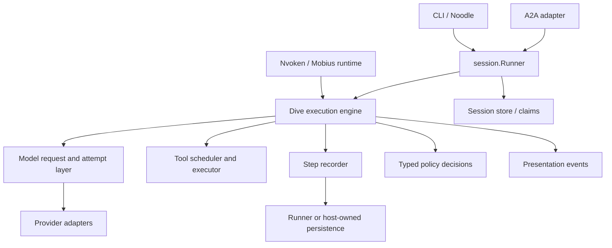

# Dive v2: architecture review and design direction

**Date:** 2026-09-26  
**Status:** Review complete; preliminary design for discussion, not implementation approval.  
**Baseline:** v1.34.0, `da15e91`.  
**Workflow:** Code review and local probes → design feedback → targeted prototype → final spec → build.

## Judgment

Dive has a useful core and several strong implementation pieces. Its biggest
deficiency is that execution facts, model-facing history, persistence, policy,
and presentation are not cleanly separated. Consumers reconstruct facts from
callbacks, hooks modify shared objects with different meanings at different
phases, and provider settings look more uniform than their behavior is.

**Keep sessions as a first-class Dive capability. Move session management out
of the engine, and give every caller the same complete execution contract.**
Moving session code alone will not accomplish this. The work must also establish
authoritative step records, explicit decisions, stable data ownership, and a
provider contract that preserves content and reports effective behavior.

The goal is a library that remains easy for a small interactive application but
does not force a durable service to reconstruct its internals. This review
complements the [consolidated feedback register](2026-09-26-dive-v2-integrator-feedback.md);
it does not repeat all 35 recommendations as an implementation checklist.

## Scope and evidence

Read paths cover agent construction, fresh execution, continuation, suspension
and resume, sequential/parallel tools, turn closure, sessions/checkpoints/claims,
hooks and reminders, normalized messages and streaming, provider configuration,
error/retry infrastructure, capabilities/pricing, permissions, and the A2A,
subagent, and OTel integration surfaces. Toolkit and experimental features were
reviewed at their architectural seams, not audited tool by tool. The CLI UI,
live providers, production services, and performance under load were not tested.

Current sibling checkouts reinforce three distinct use cases:

| Consumer                  | Observed integration                                                                                   | Consequence for v2                                                                                  |
| ------------------------- | ------------------------------------------------------------------------------------------------------ | --------------------------------------------------------------------------------------------------- |
| Noodle, pinned to v1.33.0 | Session-backed agent plus its own partial recorder, sidecar journal, and failure save path.            | Preserve a simple session runner; do not claim the v1.34 integration deletion has already happened. |
| Nvoken, pinned to v1.34.0 | Stateless agent, model wrappers, callback checkpoints, external tool coordination, and `Discard`.      | Expose execution facts and control before effects without taking over its database or lease rules.  |
| Mobius, pinned to v1.31.0 | Application-owned history and resume, callback-fed spend meter, context hooks, custom subagent policy. | Preserve application control over projection, budgets, tools, identity, and recovery.               |

Seven fake-model/schema/event probe scenarios ran against the local root module.
They make no provider calls. The probes confirmed the behavior reported below;
source-only observations are identified separately. All baseline tests listed at
the end passed, including the root execution packages under the race detector.
These findings therefore concern gaps in the tested contract, not an already
failing baseline.

## What to preserve

- The small provider interface and independently usable `llm` package. A caller
  should still be able to make one model call without adopting an agent runtime.
- Typed function tools, dynamic toolsets, composable extensions, multimodal
  results, and human-readable previews. These are useful capabilities, not debt
  to remove simply because the implementation around them is complicated.
- The centralized `turnRecord` and turn-ending path, stop classification, usage
  normalization, incomplete-turn preservation, explicit unknown tool state, and
  late-result handling. They supply much of the material for the new contract.
- The distinction between a durable record and the projection sent to a model.
  Keep provider-private replay data, human-visible output, and synthetic recovery
  context distinguishable.
- The session package's work on revisions, claims, torn writes, resynchronization,
  compaction, and forks. Reuse its tested storage behavior behind the runner.
- Retry limits at a defined stream boundary, client-call history repair, cost
  provenance, and disjoint cache-token accounting. Simplification must not erase
  these hard-won correctness rules.

## Findings that should determine the design

### 1. The public event callback is neither an observer nor a complete journal

`turnRecord.collecting` retains an item pointer and forwards the same object to
the caller. The generated message also shares content with the internal record.
In a probe, changing text inside a message callback changed both `OutputText()`
and `Turn.Messages` to `callback-mutated`. This is an ownership hole even if the
caller is well intentioned: a display filter can alter the returned record.

The callback also controls execution by returning errors, but callback errors
from terminal/cleanup emission are logged instead. Some events describe calls
that will never execute; an empty model response emits no message event. Every
raw stream/progress item is retained in `Response.Items`, even with no external
callback. Source inspection establishes retention proportional to event count;
its memory cost has not been benchmarked.

**Design consequence:** separate durable execution steps, explicit control
decisions, and presentation events. Observers receive isolated values and have
no implicit execution authority. A display stream need not retain every delta in
the final result. A recorder has an acknowledgement contract and can prevent
further effects when writing fails. A user stop uses an explicit control path.

Evidence: [turn record and collecting](../../turn.go#L16),
[callback wiring](../../agent.go#L1088),
[stream delivery](../../agent.go#L2437),
[terminal callback](../../turn.go#L722). Feedback: DIVE-01/04/05/19/24/25.

### 2. Durability is attached to session shape rather than execution facts

`CreateResponse` spends its opening section selecting session interfaces,
locking/claiming, recovering, resolving overlapping input/resume modes, and
splicing history. Checkpointing becomes active only when the session is a
`TurnStore`. Each checkpoint passes a whole turn; the file store computes its
delta internally. A relational integrator must adopt that representation or
reconstruct steps from the less complete event callback.

The loop checkpoints a successful model response before client tools execute,
but a paused server-tool response takes the resend branch without that checkpoint.
Final responses are saved at invocation end. There is no durable per-attempt
model-call-start record carrying identity and reservation context. This is not
a claim that v1.34 loses all those responses on orderly return; it identifies
crash windows and facts a stateless runtime cannot observe through a uniform seam.

**Design consequence:** define a complete step vocabulary available without
sessions. Preserve the existing distinction between observed results and confirmed
persistence. Process recovery, power-loss durability, and external side-effect
reconciliation are different guarantees. The file store already documents that
hot-path appends do not fsync by default; a new journal must not promise more.

Evidence: [session setup](../../agent.go#L677),
[checkpoint activation](../../agent.go#L1124),
[pause and checkpoint ordering](../../agent.go#L2287),
[whole-turn checkpoint](../../durability.go#L210),
[store delta handling](../../session/turns.go#L205),
[file durability contract](../../session/file_store.go#L70).
Feedback: N-01/04/06, DIVE-01/02/03/04.

### 3. Tool authorization, execution, and reporting can describe different calls

A pre-tool hook can set `UpdatedInput`, which is passed to the tool. The original
input remains on the call used by preview, tracing, result metadata, and the
turn's assistant message. The probe executed `rewritten` twice while both result
items reported `original`. All pre-tool hooks run, so a later rewrite can occur
after an earlier permission check. This ordering is visible in both execution paths.

The same probe found pre/post tool-hook iteration values `[0, 0]` across two
tool iterations: tool contexts are manually assembled without copying `Iteration`.
The comment in the generation loop promising current iteration to those hooks is
stronger than the implementation. This is a concrete example of the fragility
of sharing a large, partially populated hook context.

A second probe returned a durable-acceptance error from a tool. Dive sent it to
the model, made another model call, and returned completed. Ordinary tool failure
is useful model feedback; infrastructure failure after an uncertain side effect
needs a distinct stop. Source inspection also confirms that a permission request
auto-allows when no dialog is configured.

**Design consequence:** normalize input, validate it, run explicit transforms,
then preview/authorize the final effective call before recording and dispatch.
Record requested and effective input separately when they differ. No rewrite
after approval without reauthorization. Make deny, wait, recoverable tool error,
and fatal execution error different typed results. An absent approver must not
implicitly grant permission.

Evidence: [sequential preparation](../../agent.go#L3185),
[parallel preparation](../../agent.go#L2870),
[tool invocation/result](../../agent.go#L3419),
[no-dialog behavior](../../permission/permission.go#L370).
Feedback: DIVE-06/19/20/25/29/30/32/35.

### 4. A turn lacks one coherent working state across continuation

`generate` maintains a local working message slice while `CreateResponse` keeps
another. Stop continuation rebuilds from the outer history plus output, losing
direct `PreIteration` message additions. The probe saw its one-time nudge on
calls 1 and 2, then not on calls 3 and 4. It also made four calls with
`ToolIterationLimit: 1`: the expected two-call allowance was applied separately
to each continued loop.

Typed reminder delivery already preserves some model-only context across Stop
re-entry; it is specifically direct hook message mutation that the probe loses.
The remedy should preserve this useful existing channel rather than flatten all
context into one persistent transcript. Compaction is another projection edit,
not permission to rewrite historical execution facts.

**Design consequence:** one turn state owns call counters, pending work, usage,
and working context. Explicit commands deliver input, update context, continue,
or submit results. Count model calls across suspension and continuation, retaining
the counter in resumable state. Distinguish recorded input, ephemeral context,
projection replacement, and cumulative/snapshot context updates.

Evidence: [continuation](../../agent.go#L1361),
[working state and counters](../../agent.go#L2066),
[hook writes](../../agent.go#L2128). Feedback: DIVE-02/07/08/23/26, M-01.

### 5. The provider abstraction permits silent loss and ineffective controls

`llm.Config` explicitly documents that unsupported settings are ignored. Some
exported per-call transport/credential settings are not read by the adapters.
Provider request bodies are generally built before the mutable BeforeGenerate
hook, so that hook should not be mistaken for a request-editing contract.
Before/after/error behavior also differs between streaming and blocking paths.
Google's tool configuration is always automatic when tools are present.

The schema probe failed decoding a nullable type array and reduced an `anyOf`
property to `{}`. The citation probe lost the entire citation payload during
`llm.Event` JSON decoding: `EventDelta` has the citations tag but no citation field.
Adding a switch case to the accumulator alone would therefore be insufficient.

The normalized response/event model is strongly shaped by Anthropic's protocol.
That is not inherently wrong, but translating other providers through it must
not drop facts, invent lifecycle meaning, or make streaming less expressive than
blocking generation. Provider-specific replay content needs an explicit home.

**Design consequence:** distinguish configured defaults, resolved requests, and
effective settings. Provider preparation validates and reports transformations
before the attempt is admitted. Retain lossless schema input and canonical
content, with explicit unsupported/unknown handling. Implement shared attempt
middleware outside duplicated provider methods, with transport-specific adapters
supplying request preparation, response normalization, and structured errors.

Evidence: [config contract](../../llm/options.go#L10),
[OpenAI preparation/hooks](../../providers/openai/provider.go#L94),
[Google tool choice](../../providers/google/util.go#L730),
[delta shape](../../llm/stream.go#L108),
[accumulator](../../llm/stream.go#L242),
[tool schema contract](../../tool.go#L284).
Feedback: DIVE-09/10/11/12/13/14/15/22/27/28/31/33, M-03/04.

### 6. Model identity and completion evidence are weaker than the loop's knowledge

An empty-refusal probe returned completed with no message event, retained its
aggregate token usage, and reported `wrapper-name` as the model despite the
response specifying `served-model`. Nvoken's usage loss is downstream of missing
per-call evidence; Dive did not lose aggregate usage in this probe. These are
different claims and require different fixes.

The current record stores the last stop reason and aggregate usage, not a public
record of every attempt. Cost resolution is also installed through process-global
registration. OTel sets suspended state but does not similarly record incomplete
state/reason, and its metrics use `context.Background()`.

**Design consequence:** retain requested provider/model, served model, response ID,
attempt identity, timing, stop evidence, usage completeness, and cost provenance
per call. Build turn aggregates and tracing from those facts. Empty output must
not erase a call; a refusal must not look indistinguishable from no work. Keep
unknown usage distinct from zero and estimates distinct from billed charges.

Evidence: [initial response model](../../agent.go#L1091),
[model response/event branch](../../agent.go#L2270),
[cost resolver](../../llm/cost.go#L11),
[run tracing](../../otel/agent_run.go#L37),
[metrics context](../../otel/chat.go#L132).
Feedback: DIVE-04/11/12/16/18/34, S-01/04/09.

## Recommended architecture

Keep a small Go library with explicit execution dependencies, rather than a
general workflow platform. The core owns turn transitions and execution facts.
An optional session runner owns storage, locking, claims, and recovery startup.
Application runtimes supply equivalent services without adopting that runner.



Suggested package responsibilities, with names still provisional:

```text
dive/                 Agent facade, execution engine, turn state, commands, outcomes
llm/                  Model requests/results, canonical content, usage, capabilities
tool/                 Definitions, raw schemas, typed adapters, execution contracts
session/              Session, runner, stores, claims, forks, compaction records
providers/<vendor>/   Validation, encoding, transport, normalized provider evidence
permission/           Explicit policy and approval adapters over tool definitions
toolkit/              Built-in tools; depend on tool contracts, not session storage
subagent/             Definitions and pluggable execution seam
otel/, a2a/           Adapters over the execution contracts
internal/             Reducer, projection builder, scheduler implementation
```

The root engine must not import `session`; session and application adapters depend
on it. Tool and model contracts must not require `*Agent` or a session to execute.
Do not expose a public reducer or create a package for every internal phase merely
to make the diagram symmetrical. Keep `Agent` as the familiar entry point if an
additional public `Engine` name does not improve the caller's experience.

### Explicit entry commands and authoritative state

Use distinct start, continue, resume-results, and cancel operations, or a validated
command union. Do not keep functional options whose interpretation changes with
the presence of a session. History is always prior context; input is always new
input. A resumable state includes pending calls, accepted results, turn-wide
limits/usage, and working context, not only a list of transcript messages.

The engine produces one outcome and state snapshot per invocation. I lean toward
the proposed contract where a Go error means the invocation never started and
post-start failures live in the typed outcome. That is a significant Go API
ergonomics tradeoff: examples, helpers, and tests must make ignoring the outcome
difficult. Preserve a Go error cause for inspection without serializing arbitrary
error objects. Keep storage acknowledgement separate from execution outcome.

A “completed” model exchange can contain refusal or tool-only work. Applications
may classify those for their product, but they should not infer them from blank
text. One terminal invocation event does not imply that a suspended turn is
finished forever.

### A recording protocol, not another general callback

The proposed shape is intentionally smaller than a storage API:

```go
// Illustrative contracts, not final public signatures.
type Recorder interface {
    Commit(context.Context, Step) (Receipt, error)
}

type BeforeModel func(context.Context, ModelCallPlan) (ModelDecision, error)
type BeforeTool func(context.Context, EffectiveToolCall) (ToolDecision, error)
type Observer func(context.Context, Event) // an isolated presentation value
```

`Step`, `Receipt`, and the decision payloads require a focused prototype before
finalizing their types. Necessary protocol properties are already clear:

1. Assign stable turn, invocation, model-call, attempt, and tool-call identities.
   Host-supplied identifiers are supported and validated; store revisions and
   fencing tokens remain with the runtime adapter.
2. Record admitted model attempts and tool dispatch intent before sending work.
   A persisted intent means the operation **may** have started; a crash between
   intent and dispatch must not be falsely classified as confirmed non-execution.
3. Record every model result, including pause, refusal, empty, partial/error,
   and unknown usage, before advancing to tools or another attempt. Record tool
   results before advancing the dependent model call.
4. Serialize authoritative transitions even when tools execute concurrently.
   Record completions in observed order, project tool results in a documented
   stable order, and make concurrency bounded rather than a single on/off switch.
5. Retry a write with the same step identity and content. A rejected write and
   a write whose acknowledgement was lost are different outcomes. On uncertain
   persistence, stop effects and reconcile; do not assume a repeated append is safe.
6. Return observed state plus the last acknowledged position when recording
   fails. Never manufacture a durable TurnEnded fact after a failed terminal write.
   Cleanup saves use a bounded context independent of cancellation, while fencing
   still prevents an expired owner from writing.
7. Rehydrating execution state requires no model or tool execution. Recovery
   policy explicitly reconciles uncertain calls; idempotence hints alone do not
   authorize retrying a side effect.

An application may need to accept a result, update accounting, and drain input in
one transaction. The runner/host adapter must support that coordination; separating
interfaces must not force split transactions. The prototype should establish how
acknowledged host commands enter the engine after that transaction. A raw `Record`
callback returning arbitrary side effects would only rename the current ambiguity.

An in-memory implementation keeps simple calls simple. A session runner can own
the normal store/claim defaults. Durable hosts retain their own transactional
metadata and do not receive whole-turn snapshots to diff at every boundary.

### Policy and presentation have different failure semantics

Use a small set of phase-specific decisions for model admission/settings, tool
authorization, input delivery, and continuation. Supply immutable context views
and explicit edits rather than a shared map of potentially writable fields.
An infrastructure error fails the invocation; a denial is an intentional decision.

Observer payloads need real isolation, not merely a “do not mutate” comment.
Choose copy boundaries or immutable accessors after measuring representative
large messages. Offer bounded asynchronous presentation delivery with explicit
drop/coalesce/backpressure policy; never silently lose authoritative steps. A
broken UI subscriber must not become an accidental durability mechanism. Live
display remains tentative until the corresponding result is acknowledged.

### Provider requests should be inspectable and honest

Use explicit request data and a provider preparation phase producing effective
settings, capability decisions, transformation evidence, and request identity.
Call middleware surrounds the logical call and each retry attempt, including
stream termination and failure. Preparation must finish before admission, and
admission must occur before network effects. Credentials are resolved separately
and excluded from recorded plans and diagnostic serialization.

Known unsupported settings fail by default. Unknown models/features are reported
as unknown and can use a deliberate passthrough/extension path; a static catalog
must not prohibit every new model. Capability records should include provenance
and qualification/version information. Endpoint dialect matters as well as model
name, especially for compatible gateways.

Retain raw JSON Schema, canonical tool-result blocks, complete citations, and
provider-scoped replay artifacts through live and serialized paths. Preserve
unknown stored blocks as opaque data where possible, but do not blindly resend
them to an incompatible provider or silently discard them. Version decoding,
projection, and provider support are separate decisions.

Do not require streaming merely because a model implements an interface. Both
paths should end in a canonical result; adapters may share accumulation machinery,
but the caller should not have to reconstruct provider truth from UI deltas.
Missing provider evidence must be reported rather than filled with guesses.

### Tools and context retain their useful expressiveness

Separate local executable tools, external declarations, and provider-hosted tools.
Use raw JSON at the call boundary and typed decoding inside adapters. Keep rich
results and previews; avoid nil-schema/sentinel-call conventions. Implement one
prepare/authorize/execute/accept pipeline shared by sequential and parallel modes.
Specify external-tool ordering explicitly instead of automatically reordering all
inline siblings ahead of waits.

Context updates carry independent dimensions: author/origin, authority, delivery
scope, and cumulative versus replacement semantics. Recorded input survives
continuation; transient context has an explicit lifetime. Compaction changes the
model projection while the turn record retains original work. Effective request
evidence should explain transformations without forcing every application to
store duplicate full prompts on every call.

Keep process-local background work as a supported convenience. A replaceable spawn
interface lets a host supply durable child execution without putting a distributed
scheduler, tenant ledger, or application authorization system inside Dive.

## Priorities, alternatives, and migration

### Priorities

| Priority | Work                                                                                                        | Why it goes here                                                                                                                        |
| -------- | ----------------------------------------------------------------------------------------------------------- | --------------------------------------------------------------------------------------------------------------------------------------- |
| 1        | Canonical step/state/outcome contract; session runner; typed recording and control boundaries               | Removes the most duplicated integration logic and determines later interfaces.                                                          |
| 2        | Tool preparation/authorization/result pipeline; explicit input/continuation; bounded execution              | Fixes mismatched evidence and gives the state model reliable semantics.                                                                 |
| 3        | Provider preparation/attempt middleware, lossless schemas/content, effective settings, conformance fixtures | Turns provider independence into a dependable contract and removes wrappers/parsers.                                                    |
| 4        | Codec/migration, test helpers, complete tracing, examples, packaging cleanup                                | Makes the redesign safe to adopt and keeps the simple path small. Codec design starts early even though migration delivery comes later. |

Correctness repairs such as citation payloads, schema support, tool-input reporting,
ignored tool choice, and explicit approval behavior should not wait for the entire
v2 architecture. Each still needs compatibility review. Do not silently backport
major event/default changes under a minor release merely because they fix a flaw.

### Alternatives considered

**Only consolidate Session interfaces:** the smallest migration, and worthwhile
if session duplication were the dominant problem. It leaves stateless callers
rebuilding evidence and does not fix callbacks, tools, or provider fidelity.

**Remove all sessions and make each app own storage:** a smaller core at the
expense of recreating Noodle's original problem. Keep a supported session runner.

**Public event-sourced workflow framework:** powerful but far beyond the proven
need. Use explicit steps and an internal transition reducer without committing
users to distributed workflow machinery, a database schema, or an actor framework.

**Keep one mutable hook bus and document it better:** cheaper initially, but the
argument rewrite and continuation probes show that semantics already depend on
which slice or pointer a phase reads. Documentation alone will not enforce ownership.

**Consolidate every Go module at once:** simplifies version bumps but expands
dependency scope and migration. Keep provider module boundaries initially unless
the prototype shows a concrete simplification; add version-skew validation and
test the actual multi-module combinations. Packaging is not the main deficiency.

### Migration approach

1. Capture the probe cases as deterministic conformance tests and preserve current
   recovery/cancellation fixtures. Add record/replay equivalence tests before
   replacing the execution loop.
2. Prototype the core contract with one fake model, one local tool, one external
   tool, an in-memory recorder, a file-backed runner, and an application-style
   transactional recorder. Interrupt at every recording/effect boundary.
3. Reuse v1 helpers where their semantics fit; move session concerns behind the
   runner and replace execution paths incrementally. Adapt extensions, permission,
   A2A, and orchestration against the new contract instead of carrying `HookContext`
   wholesale into v2.
4. Provide an explicit v1 data reader/import path with fixture coverage for
   completed, incomplete, suspended, running, compacted, and forked histories.
   Preserve original provider artifacts and unknown execution states. Do not
   rewrite persisted files on first load without an explicit migration policy.
5. Exercise Noodle's session use and Nvoken/Mobius-shaped external persistence
   before release. Compare deleted reconstruction code and required adapters,
   not only the new engine's line count. Publish behavioral migration examples.

The Go module import/version migration and compatibility adapter location need
their own concrete release checklist. Do not mix legacy behavior branches into
the new engine merely to avoid mechanical caller changes.

## Verification and remaining questions

Local probe results at the baseline:

| Probe                                                    | Observed result                                                                                              |
| -------------------------------------------------------- | ------------------------------------------------------------------------------------------------------------ |
| Two tool calls rewritten by PreToolUse                   | Tools received `rewritten`; result metadata carried `original`; pre/post tool iterations were both `[0, 0]`. |
| One nudge, one Stop continuation, tool iteration limit 1 | Four model calls; nudge visibility `[true, true, false, false]`.                                             |
| Message observer edits text                              | Returned output and turn record both changed to `callback-mutated`.                                          |
| Empty refusal from a model reporting `served-model`      | Completed, zero message events, aggregate usage retained, response model `wrapper-name`.                     |
| Tool returns infrastructure error                        | A second model call ran; turn completed.                                                                     |
| Nullable/union schema round-trip                         | Nullable type-array decode failed; `anyOf` property became `{}`.                                             |
| Citation delta JSON round-trip                           | Delta type survived; citation payload disappeared.                                                           |

Validation performed with provider credentials and live-test opt-ins removed
from the test environment:

- `go test -race ./. ./llm ./session ./permission ./providers/...` passed in the
  root module. This covers the root provider packages, not nested modules.
- `go test ./...` passed separately in `providers/openai`, `providers/google`,
  `providers/grok`, `providers/meta`, `a2a`, and `otel`. These use their declared
  module dependencies; the root replacement was used for the independent probes.
- No live model calls, production writes, or application changes were performed.
  No production Go code was changed for this review.

Before a final v2 spec, resolve four questions through the prototype:

1. **Recording acknowledgement and transactional host commands.** Can both the
   file runner and a database-owning host use the same protocol without whole-turn
   diffs, split transactions, or ambiguous write outcomes?
2. **Outcome ergonomics.** Does response-only execution failure improve real
   callers enough to justify departing from familiar `(result, err)` expectations?
   Exercise failure handling in both a tiny program and a service adapter.
3. **Payload ownership and retention cost.** Benchmark isolated event delivery,
   long tool results, stream capture, and retained provider artifacts. Set bounded
   defaults based on those results rather than introducing unmeasured copying.
4. **Provider preparation contract.** Can Anthropic HTTP, OpenAI SDK, and Google
   SDK paths report the same effective request/attempt facts while retaining
   provider-specific features and per-call credentials?

The review supports a concrete direction now. The final public signatures and
storage protocol need this small implementation exercise before they are frozen.
