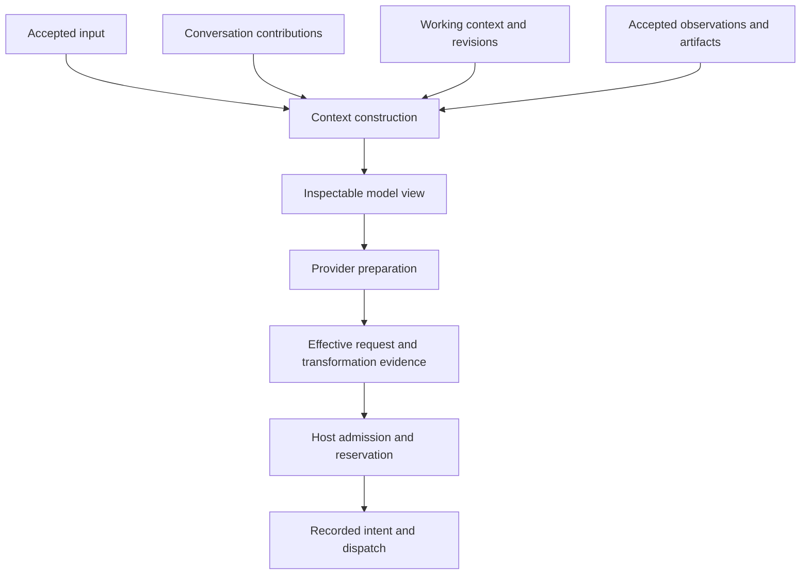

# Dive v2: a coherent model for agent execution

**Date:** 2026-09-26  
**Status:** Proposed direction for design review. Names, interfaces, and storage formats are provisional.  
**Workflow:** Integrator evidence → code review → recovery prototypes → conceptual redesign → consumer experiments → final specification.

## Recommendation

Make Dive a library for executing model-directed work, with a familiar agent API
built on top of a small, explicit execution protocol.

The earlier recommendations optimized for a credible migration from v1. They
separated recording, policy, and observation but retained much of the shape of
`Agent.CreateResponse`. The stronger proposal is to reconsider that shape itself.
Producing a response is one useful operation; it is not a sufficient organizing
concept for work that can wait, delegate, produce artifacts, survive processes,
or require reconciliation after an uncertain side effect.

The core should describe what work was accepted, what it needs next, what is
known to have happened, and what remains unresolved. A runtime performs that
work. A session supplies a convenient conversation-oriented experience. The
same execution semantics should serve a small local application and an
application-owned durable service.

This document consolidates the analysis, recommendations, proposed concepts,
relationships, prototype lessons, trade-offs, and outstanding decisions. It is
the proposed conceptual direction, not a claim that the prototype implements
it or that the public v2 API has been approved.

## Evidence and relationship to earlier documents

- The [integrator feedback register](2026-09-26-dive-v2-integrator-feedback.md)
  preserves the detailed Noodle, Nvoken, Mobius, and Swarm requests. Its
  [downstream addendum](2026-09-26-dive-v2-integrator-feedback.md#addendum-downstream-nvoken-integrations)
  connects Jibblywibbly and Nabaname's Nvoken experience to Dive.
- The [architecture review](2026-09-26-dive-v2-architecture-review.md) records
  source findings and local probes against Dive v1.34.0. Examples include observer
  mutation affecting history, transformed tool input differing from reported
  input, and continuation behavior losing context or resetting limits.
- The [top recommendations](2026-09-26-dive-v2-recommendations.md) give the first
  prioritized direction: shared execution records, sessions around the engine,
  explicit commands, one tool pipeline, and honest provider contracts.
- The [execution prototypes](../../experimental/v2/README.md) test recording,
  uncertainty, recovery, identity, and ownership. Their results and limits are
  summarized below.

This proposal retains the correctness lessons of those documents, but goes
further than moving persistence outside the existing loop. It also reopens the
earlier recommendation to keep the reducer internal: a public advancement
protocol may be useful if real hosts need to drive execution themselves. That
does not imply exposing every internal reduction function or record variant.

The downstream Nvoken assessments are evidence about integration friction, not
proof that every reported problem originates in Dive. Their package-version
claims and application defects remain attributed to those assessments.

## The structural problem

Today, several concepts overlap around Agent and its response loop:

- An agent's behavioral definition and its concrete model/tool bindings.
- One accepted unit of work and one process invocation handling it.
- Conversation history, working context, and the request sent to a provider.
- Tool output, control instructions to the runtime, and human-visible display.
- Execution facts, progress notifications, policy decisions, and persistence.
- A finished model exchange, a finished invocation, and finished application work.

The result is coupling through shared objects, hook timing, option combinations,
and session interface detection. A new behavior must negotiate several meanings
at once. Background work, external tools, human input, and child agents acquire
special paths because they do not fit comfortably inside a synchronous response.

Reducing the size of `agent.go` would not by itself solve this. Better cohesion
means each part owns a stable responsibility; lower coupling means consumers
interact through meaningful contracts rather than knowing when to mutate a
particular internal field.

The design should pass a stronger test: adding a capability should usually
compose existing concepts instead of requiring another execution exception.

## The conceptual model

| Concept          | Owns                                                                                  | Relationship to the others                                                                                            |
| ---------------- | ------------------------------------------------------------------------------------- | --------------------------------------------------------------------------------------------------------------------- |
| Agent definition | Versioned instructions, capability requirements, model-selection policy, and behavior | Reusable across runs; contains no per-run mutable state or process ownership.                                         |
| Run              | Accepted work, progress, pending effects, observations, limits, and outcome           | References its accepted definition/configuration; may span process invocations and need not belong to a conversation. |
| Conversation     | Ordered contributions across runs and optional branches                               | Supplies context; may contain contributions from different agents. It is not the execution journal.                   |
| Runtime          | Concrete execution, scheduling, recording coordination, bindings, and ownership       | Drives runs using local or host-supplied models, tools, stores, and policies.                                         |
| Context plan     | The intended model view and the reasons for including or transforming material        | Built from accepted input, conversation, working context, and observations for a particular call.                     |
| Session          | A convenient conversation-oriented entry point                                        | Selects conversation state and drives runs through a runtime with useful defaults.                                    |
| Capability       | A versioned operation's model-facing meaning, input contract, and result contract     | Independent of whether its executor is a local function, queue worker, or service.                                    |
| Artifact         | Identified output or referenced content, with type and provenance                     | Can have different model, UI, and storage representations without becoming several unrelated outputs.                 |

These are semantic responsibilities, not a requirement for eight public classes
or eight packages. Some should remain plain values or internal implementation
details until a consumer needs them independently.

### Definitions, runs, and environments

One definition can serve many runs. One run can survive several worker processes.
One conversation can contain contributions from different definitions. A run
that generates a report or performs a scheduled task need not invent a chat
conversation simply to obtain durable execution.

A definition describes behavior. Runtime bindings supply concrete implementations,
credentials, transports, storage, and execution placement. A run records which
definition and relevant configuration were accepted. A deployment must not
silently change the tool contract or instructions of already accepted work.

Not everything can be serialized: Go functions, closures, and credentials need
runtime resolution. References to code or configuration require versioned
bindings or a deployment manifest, and a defined failure when the historical
binding is unavailable. A digest alone does not reproduce executable behavior.

### Session remains useful, but changes role

Keep the convenient session experience. Retire “Session as an optional
persistence interface inside Agent” as the organizing model.

A session runner owns the normal load/claim/advance/save experience and can reuse
the existing stores' work on claims, revisions, forks, and recovery. The kernel
does not select among session persistence interfaces. A sophisticated host owns
its database and leases without replacing the agent's behavioral implementation.

The default path must stay small. An illustrative facade might look like this;
these names are not implemented APIs:

```go
definition := dive.Define(dive.Definition{
    Instructions: "Help the user investigate their project.",
    Capabilities: []tool.Definition{readFile, searchFiles},
})

runtime := dive.NewRuntime(dive.Bindings{
    Model: model,
    Tools: localTools,
})

session := runtime.NewSession(definition)
result, err := session.Run(ctx, dive.Input("Explain this project"))
```

Supplying trusted context or a custom recorder must be an incremental change to
this path, not a reason to rebuild admission, tool execution, and recovery.

## Transformation 1: execution as a resumable protocol

Replace the monolithic response loop with a kernel that advances explicit state
from explicit inputs and proposes transitions and work. A runtime executes the
work and returns observations.

```go
// Illustrative protocol, not a settled public API.
func Advance(state RunState, command Command) (Transition, error)

type Transition struct {
    Records []Record        // Proposed records, not acknowledged persistence.
    Effects []EffectRequest // Descriptions of work, not executable closures.
}
```

An effect request might ask for a prepared model call, a capability invocation,
or child execution. Human approval is a pending decision with its own semantics.
These cases share identity, pending-state, acceptance, and recovery machinery;
they do not need identical scheduling or failure policies.

The kernel must not perform network calls, run tools, read a wall clock, or
silently resolve changing configuration while advancing recorded state. Such
inputs arrive explicitly. Policies that depend on external state are evaluated
at runtime boundaries and their relevant decisions are accepted as inputs.
Replaying recorded observations reconstructs execution; it never reruns a model
or tool to recreate the past.

The default runtime drives this protocol for ordinary callers. An application
runtime can drive the same protocol around its transactions, queues, and leases.
This is deeper inversion than an injectable persistence callback.

### Proposed transitions are not permission to dispatch

The runtime must perform the relevant preparation, policy checks, and recording
before dispatch. A useful lifecycle is:

1. Propose work from the acknowledged run state.
2. Resolve the necessary context and bindings and prepare the effective request.
3. Authorize that request and reserve any host-controlled spending authority.
4. Atomically accept the required transition and dispatch intent under the
   host's revision/ownership rules.
5. Dispatch through the selected executor.
6. Accept observations/results and associated accounting before advancing
   dependent work.

The protocol must represent admission decisions and failures as well as execution
results. A host must be able to combine accepting a result, updating accounting,
and consuming input in one transaction; separate interfaces must not force
separate commits.

A duplicate commit acknowledgement does not grant a new permission to execute.
After ownership handoff or ambiguous acknowledgement, reload the state and
reconcile pending work. Database fencing does not stop a stale process from
performing an external side effect; the downstream execution path needs compatible
idempotency/fencing or an explicit reconciliation strategy.

### Identities have different jobs

| Identity                           | Meaning                                                                                    |
| ---------------------------------- | ------------------------------------------------------------------------------------------ |
| Run identity                       | The accepted unit of work to recover.                                                      |
| Effect identity                    | The logical operation requested within the run.                                            |
| Attempt identity                   | A particular execution attempt where retry is permitted.                                   |
| Command/delivery identity          | An input or result delivery that can be acknowledged repeatedly without applying it twice. |
| Definition/context revision        | Which behavior and model-view inputs were accepted.                                        |
| Ownership token and state revision | Who may mutate state now and which state a transition was based on.                        |

These must not collapse into one idempotency key. Retry rules must specify whether
the downstream key identifies a logical effect or a particular attempt. Changing
a delivery ID must not be a workaround for a conflicting submission.

The current prototype has identified attempts/effects and result commands, but
does not establish the complete retry hierarchy proposed here.

### Lifecycle, certainty, and delivery are separate dimensions

A run can be waiting while its worker invocation has returned successfully. A
caller can stop waiting while the work continues. Execution can succeed while
saving its result fails. A tool can have an unknown outcome after a transport
timeout. Empty text says none of these things.

Represent separately:

- Work lifecycle: active, waiting, stopped, or completed, with explicit reasons.
- Effect knowledge: proposed, potentially started, observed success/failure,
  confirmed nonexecution, or uncertain.
- Persistence: acknowledged, rejected, or acknowledgement unknown.
- Caller delivery: following, disconnected, locally timed out, or finished.

Exact enums remain a design task. Avoid a single status whose combinations hide
important distinctions. Stopping future execution must not erase unresolved
effects or prevent recording a late observation needed for reconciliation or
accounting. Whether that late observation permits further work is a separate
decision.

Machine-tool deadlines, human waiting, budget waits, and local caller timeouts
must remain distinguishable. Cancellation is a request to stop particular work,
not proof that a previously dispatched operation had no effect.

## Transformation 2: context construction as a first-class subsystem

A mutable message slice is insufficient to represent conversation, operator
instructions, retrieved material, observations, summaries, and private replay
data. Each has different provenance, authority, lifetime, and visibility.



A context plan should explain why material is included, who supplied it, its
authority, its delivery scope, and what was omitted or transformed. Persistent
instructions, one-call guidance, a run-scoped snapshot, and an application update
must not become indistinguishable strings appended to history.

Compaction becomes a versioned transformation of the model's view. Preserve the
account of what happened independently of whether every original byte remains
in the next prompt. Record enough references and transformation evidence to
inspect the effective view without forcing duplicate full-prompt storage for
every call. Retention and erasure can make historical content unavailable; the
system must state that limitation instead of promising replay of deleted data.

Dynamic context remains supported. Freeze accepted inputs and explicitly record
subsequent context changes or newly resolved material. Pinning configuration
does not mean pretending that external information can never change.

This makes useful capabilities natural: preview a request before spending money,
explain an omitted source, replace one named context contribution, test authority
preservation across providers, and continue with the same accepted inputs after
an interrupted invocation.

## Transformation 3: explicit policies and commands instead of mutable hooks

Retire the general mutable `HookContext` from the new core. Its fields vary by
phase, and extensions depend on timing and one another's mutations. Splitting
the same context into smaller files would preserve that coupling.

Replace its jobs with contracts that state their purpose:

| Contract             | Responsibility                                                                           |
| -------------------- | ---------------------------------------------------------------------------------------- |
| Context contributor  | Supplies material with explicit origin, authority, lifetime, and replacement semantics.  |
| Request transformer  | Produces a new proposed request and explains the change.                                 |
| Authorization policy | Approves, denies, or defers an effective request.                                        |
| Scheduling policy    | Determines ordering, resource conflicts, concurrency, and dispatch eligibility.          |
| Command              | Accepts input/results or requests a change to the work lifecycle.                        |
| Observer             | Receives isolated facts or tentative display updates without implicit control authority. |

Composition rules are part of the API. A later rewrite invalidates approval of
the earlier request. A denial does not disappear because another policy allows
the operation. A deferred human approval refers to the actual effective request
being approved, including relevant version identity.

Extensions may still bundle these contributions for convenience. They do not
gain arbitrary access to the execution machinery through a shared mutable bag.
Provide targeted escape hatches only where a concrete integration demonstrates
the need, and specify their ownership and replay consequences.

Observers need both value isolation and explicit backpressure behavior. A slow,
disconnected, or broken display subscriber must not become the durability
mechanism. Streamed display content may be tentative until its corresponding
result is accepted. Authoritative records cannot share a lossy delivery policy
with UI deltas.

## Transformation 4: capability meaning independent of execution placement

Separate four things that are currently too easy to combine:

1. A capability's name, schema, semantics, result contract, and version.
2. An identified invocation with final effective arguments.
3. A binding that knows how and where to execute it.
4. An observation describing its outcome and outputs.

A local function, queue worker, or application service can implement the same
capability contract. Moving its execution must not require redefining the
model-facing operation or inventing a new result-acceptance protocol.

Preserve raw JSON Schema at the boundary and typed decoding inside local
adapters. Tools receive their stable invocation identity so they can use it in
downstream requests and reconciliation records. Preview, authorization, execution,
tracing, and replay refer to the same effective arguments.

The executor's routing and authority come from trusted runtime bindings, not
model-supplied metadata. A schema validates input shape; it does not grant
permission to perform an operation.

### Scheduling and resource conflicts

Replace a single parallel/sequential switch with bounded execution and explicit
ordering requirements where needed. A call may require a resource exclusively,
depend on an earlier result, or belong to a sequence that stops after failure.
Those requirements belong in execution policy and capability metadata, not
duplicated branches in sequential and parallel tool implementations.

Begin with the actual resource conflicts consumers have. Do not build a generic
distributed resource scheduler merely to make the abstraction comprehensive.
Late results remain identified observations even when the initiating invocation
has ended.

### Child agents and background work

Child execution is another run with explicit parent/child relationships,
capability grants, input, and result delivery. The default runtime may execute
it in-process; a durable host may schedule it elsewhere. Spawning a child must
not inherently mean starting a goroutine.

Relationship does not imply authority. A child should receive explicit delegated
capabilities and any selected shared budget; parent-child lineage alone must not
grant tools, credentials, or spending permission. Waiting for a child, following
its progress, and owning its execution are separate responsibilities.

### Provider-managed operations remain different

A provider may execute built-in tools inside one provider request. Represent
their observed activity and usage where evidence exists, but do not claim that
Dive individually admitted, scheduled, or can retry each hidden operation. A
coherent protocol preserves this distinction instead of forcing all tools into
a falsely uniform local execution contract.

## Transformation 5: structured outputs and artifacts

Text is one representation of a result, not its identity. A tool or run may
produce a document, dataset, image, receipt, and explanation. The model, UI, and
durable record can need different representations of those same outputs.

Preserve typed content, stable references, provenance, and relationships:

- Small results can remain inline for simple applications.
- Large results can use host-resolved references with explicit type and access
  rules, plus an appropriate model-facing view.
- Citations and relationships refer to identifiable content, rather than
  depending on where text happened to appear in a stream.
- A human-readable preview does not replace the canonical result.
- Provider-private replay material is tagged and retained when needed, without
  treating it as ordinary user-visible text.

Hosts own blob storage, credentials, retention, and access control. A reference
is not itself authority to read an artifact. Resolving external content is
runtime work with explicit failure behavior, not hidden I/O in the kernel.

This reduces the cycle of placing large data in model text, truncating it, and
inventing recovery tools to fetch content that the application already owns.
It also improves the connection between tool outputs and durable user artifacts.
The exact shared content representation needs a focused experiment; a sprawling
universal content hierarchy would introduce a different kind of complexity.

## Transformation 6: provider preparation as a dependable boundary

Keep the independently usable `llm` layer. A caller should be able to make one
model call without adopting runs or sessions.

Provider adapters prepare an inspectable effective request before execution.
Preparation should expose:

- Requested model identity, resolved routing where known, and effective settings.
- Supported, rejected, transformed, or explicitly passed-through features.
- Tool schemas and tool-choice behavior actually being sent.
- Content conversion and replay compatibility decisions.
- Request/plan identity needed to connect admission to the attempted operation.

Record the served model separately when the provider supplies it. Pinning a model
identifier does not freeze a vendor's implementation behind a mutable alias.
Qualification and capability metadata need provenance; a stale static catalog
must not silently decide that a new feature is supported or prohibit every new
model.

Known unsupported settings should fail by default, with an explicit lenient or
provider-specific escape path. Preserve raw schemas, citations, multimodal
content, and provider-private replay artifacts. Unknown stored content may be
retained opaquely, but must not be blindly replayed to an incompatible provider.

Separate preparation, admission, logical calls, and retry attempts. A fallback
that changes the effective request may require new authorization or reservations.
Credentials are resolved outside recorded diagnostic plans.

Streaming and non-streaming execution should end in the same authoritative
result contract. Streaming additionally supplies tentative observations. Neither
the caller nor the UI should have to reconstruct the final provider result from
display deltas. Empty, refused, paused, truncated, failed, and successful calls
all need usage/identity evidence, with missing evidence explicitly unknown.

## Proposed package and dependency structure

Names are illustrative and should be reduced if consumer experiments show that
some do not deserve a public package.

```text
dive/                 Agent definitions, convenient facade, default runtime composition
run/                  State, commands, observations, transitions, effect contracts
prompt/               Context construction, projection, transformation evidence
llm/                  Model requests, preparation/execution contracts, content, usage
tool/                 Capability definitions, schemas, typed adapters, invocations
session/              Conversation-oriented runner and storage adapters
providers/<vendor>/   Concrete provider backends
toolkit/              Concrete capabilities
permission/           Authorization and approval adapters
subagent/             Child definitions and convenient child-execution adapters
otel/, a2a/           Adapters over public execution contracts
internal/             Implementation details that do not require public extension
```

The kernel may depend on small model/tool value contracts, but it must not import
session stores, provider SDKs, concrete toolkit code, or application databases.
The `llm` and `tool` contracts must not require `*Agent` or a session. Context
construction accepts explicit projection inputs; it must not reach through a
runtime object to mutate execution. The facade/runtime coordinates these parts
and supplies adapters.

The architecture is a small execution core with ports and adapters. It does not
require an interface for every struct, a dependency-injection framework, or
separate modules for every phase. Public interfaces should correspond to real
variation: local versus application-owned execution, different providers, and
different context or policy implementations.

### Cohesion and coupling checks

| Change                                  | Parts that should change                      | Parts that should remain independent                  |
| --------------------------------------- | --------------------------------------------- | ----------------------------------------------------- |
| Add a provider or endpoint dialect      | Provider preparation/transport/normalization  | Session recovery, tool scheduling, agent behavior     |
| Move a tool to a queue worker           | Runtime binding and delivery adapter          | Model-facing capability and result contract           |
| Add a context source                    | Context contribution/resolution               | Tool execution and store selection                    |
| Add human approval                      | Decision policy, pending-decision delivery/UI | A second agent loop or fabricated model tool protocol |
| Switch local storage to a host database | Recording/ownership adapter                   | Behavioral definition and transition semantics        |
| Add a display surface                   | Observer projection/delivery                  | Authoritative execution and accounting                |
| Change child execution placement        | Child runtime adapter                         | Parent's work/result semantics                        |

If these changes repeatedly require edits across unrelated parts, the boundaries
are wrong even if every individual package is small.

## What to preserve and what to retire

Preserve the useful capabilities and hard-won correctness of v1:

- Independent model access, typed function-tool ergonomics, dynamic toolsets,
  multimodal results, previews, and composable extension bundles.
- Incomplete-work preservation, unknown-effect states, late-result handling,
  explicit stop classification, and limits that survive continuation.
- Session revisions, claims, recovery, compaction/fork knowledge, and bounded
  retry behavior at defined stream boundaries.
- Normalized usage with provenance and complete request/result evidence.

Be willing to retire substantial API structure:

- Optional session-interface detection inside the agent's generation loop.
- One mutable hook context shared across unrelated phases.
- A response item callback that simultaneously means presentation, execution
  control, persistence, and accounting.
- Overlapping input/continue/resume options whose meaning depends on session
  shape or previous calls.
- Tool results that mix produced content with instructions to start process-local
  background work or suspend through a separate special path.
- Message history as both the authoritative execution record and whatever the
  next model request happens to need.
- Separate tool pipelines for local, parallel, external, and background cases
  where their core preparation/acceptance semantics should be shared.

This is a major-version opportunity. Compatibility is a migration concern, not
a requirement to preserve every existing concept indefinitely. Renaming types
without removing those overlaps would not deliver the intended improvement.

## What the prototypes established

The prototypes under `experimental/v2` have one engine and two recording owners:
a file-backed session runner and a simulated application transaction. They test
rejection and lost acknowledgement across a complete turn, preserving observed
but unsaved results, input/limit retention, observer isolation, effective tool
arguments, idempotent accounting, external results, and explicit uncertainty.

The first independent review found two real contract defects:

1. A tool could complete a side effect and then return a transport timeout; the
   prototype permanently marked it failed and removed the ability to reconcile.
2. The journal had a stable effect ID, but the local tool did not receive it.

Both were fixed. Tool invocations now receive an effect ID, and transport errors
preserve a pending uncertain effect. Result acceptance carries a command identity;
identical redelivery is acknowledged without advancing execution, while changed
content under the same identity is rejected.

A second experiment starts separate worker processes against a surviving local
HTTP service. The service commits a simulated charge and closes the connection
before replying. The first worker records uncertainty and exits. Ownership moves
to a new worker, which looks up the receipt and accepts it. The service also loses
that acceptance acknowledgement. Repeated delivery remains harmless, explicit
continuation completes, and stale-owner or conflicting writes are rejected.
Another test transfers ownership while the old tool is still running and rejects
its late write while preserving the observation for the new owner.

Focused race tests, vet, and the runnable demo passed. The second independent
review confirmed the original defects were fixed and found no new blocking
correctness issue within the documented assumptions. A reviewer probe also
canceled the actual invocation context after simulated side-effect success;
uncertainty persisted and a new owner reconciled it without another effect.

### What remains unproved

- The workers restart, but the subprocess test exits normally after recording
  uncertainty. It does not kill the worker between the side effect and that write.
- The surviving service uses in-memory locks and a simulated ledger. It does not
  qualify production SQL isolation, leases, downstream providers, or service-crash
  durability. Its fencing behavior depends on cooperating downstream execution.
- The file snapshot journal has a single-writer contract and deliberately poor
  scaling. It is not a replacement for the production session store.
- The prototype is text-only with one tool per model result. It lacks full
  provider replay, streaming, multiple pending siblings, dynamic context, and
  production compatibility fixtures.
- Direct engine calls can accept an already-cancelled start because the prototype
  uses a cancellation-independent context for all commits. Start acceptance versus
  cleanup persistence still needs an explicit semantic decision.
- Most importantly, the prototype engine still directly calls models and tools.
  It demonstrates an injectable recording boundary, not the fully host-driven
  execution protocol proposed in this document.

Keep the tests and discovered invariants. Do not treat the current prototype's
types, full-history copying, file format, or control loop as the implementation
template for v2.

## Lessons from the higher Nvoken layer

The Jibblywibbly and Nabaname assessments reinforce five principles:

1. **Convenience APIs must preserve the real contract.** Trusted context, reasoning,
   lineage, authoritative usage, and streaming are ordinary production needs.
   A convenient facade should not force applications into rebuilding its runtime
   when they need one of them.
2. **Recover accepted work without rebuilding the original request.** Context and
   deployments change. Stable submission identity, an admission receipt, and
   accepted configuration make recovery distinct from resubmission. Strict
   conflict checking remains valuable.
3. **Durable work needs an executor, not merely a durable row.** Disconnecting a
   stream must not accidentally remove the only host-tool handler. Execution
   ownership, following progress, and local wait deadlines must be independent.
4. **Spending authority and accounting require complete attempt boundaries.**
   Nvoken can reserve selected budgets before dispatch and retain evidence after
   content erasure only if Dive supplies identified prepared work and honest
   results/uncertainty. Lineage does not authorize shared spending.
5. **Test installed artifacts and actual consumer flows.** Reported serialization
   defects and SDK version drift demonstrate the limits of source-only tests.
   Measure deleted integration code while preserving behavior.

Keep tenant administration, memory generation/reset operations, Agent deployment
reconciliation, shared-budget products, and retail billing in their proper
layers. Dive supplies execution facts, version references, explicit lifecycle
operations, and control boundaries. Nvoken supplies its durable service and
authorization model. Applications retain their business rules.

## Alternatives and trade-offs

| Direction                                              | Attraction                                               | Reason to go further or limit it                                                            |
| ------------------------------------------------------ | -------------------------------------------------------- | ------------------------------------------------------------------------------------------- |
| Consolidate the current Session interfaces             | Smaller migration and fewer branches                     | Leaves execution ownership, mutable hooks, and model-view/history ambiguity largely intact. |
| Put a recorder around the existing agent loop          | Already demonstrated useful recovery behavior            | Does not let a host drive work placement without additional wrappers and callbacks.         |
| Remove sessions entirely                               | Smaller core surface                                     | Transfers routine conversation and storage orchestration to every small application.        |
| Build a generic workflow/DAG framework                 | Broad orchestration vocabulary                           | Risks overwhelming the actual agent use cases and competing with host schedulers.           |
| Explicit agent execution protocol plus default runtime | One semantic foundation for simple and durable consumers | Requires versioned state, careful ownership semantics, richer tests, and a real migration.  |

The last direction is recommended. Its costs are substantive: more explicit
values, preparation/acceptance stages, versioning obligations, and potentially
copying or storage overhead. These costs must be hidden by good defaults where
possible and justified by simpler integrations where they are exposed.

Avoid turning every hypothetical variation into a public interface. Avoid a
global event bus, universal mutable context, or generic effect type that erases
the differences between model calls, tools, human decisions, and children.
Shared lifecycle machinery should preserve domain semantics.

## Validation and migration sequence

### 1. Test the deeper execution boundary

Build one small advancement protocol that proposes work without executing it.
Drive it with both the default local runtime and an application-owned runtime.
Use the same behavioral definition and verify equivalent accepted observations.
Exercise model calls, a local/external capability, and a pending human decision;
these are sufficient to expose whether the proposed abstraction is useful.

### 2. Use a representative Nvoken integration

Accept work with trusted context and pinned configuration, lose the admission
response, change the application's current context/configuration, and recover
the accepted work by identity without resubmitting it. Continue through an
independently owned tool executor and retain outcome/usage evidence.

Require one admission for the intended work, strict conflicts for changed
submissions, faithful accepted configuration, no duplicate effects/accounting,
and measurable removal of application glue. Use a real integration boundary;
do not keep expanding a simulated framework as a substitute for consumer proof.

### 3. Qualify context and provider preparation

Exercise actual Anthropic, OpenAI, and Google adapter preparation against
representative schemas, content, tool choices, authority levels, and unsupported
settings. Separate deterministic encoder/contract tests from live-provider proof.
Show that the request inspected by admission is the one attempted and that final
results agree across streaming and non-streaming paths.

### 4. Close the narrow failure and cancellation gaps

Kill a worker after the external effect but before recording uncertainty. Test
ownership expiry/takeover, stale dispatch, repeated result delivery, and late
observations after a stop request. Choose explicit behavior for an already-
cancelled start. Define which command identities are retained and how erasure or
retention affects future duplicate detection and recovery.

### 5. Freeze only the boundaries that survive those experiments

Specify the vocabulary, wire/state versions, admission/acknowledgement semantics,
content codecs, and compatibility constraints before replacing production code.
Keep the simplest facade small and show how callers add context, recording,
policies, and external execution without rewriting their integration.

### 6. Migrate in supported slices

Preserve the existing independent `llm` use case. Introduce adapters for old agent
and session usage where their semantics can be preserved honestly. Migrate one
session-backed consumer and one application-owned runtime. Version stored state
and keep fixture tests for old data. Do not silently reinterpret suspended work
or promise arbitrary mid-run migration between incompatible definitions.

Keep correctness repairs that can safely ship independently separate from the
major-version redesign. After consumers migrate, remove obsolete interface
detection, hook pathways, and duplicated tool pipelines rather than carrying
both architectures indefinitely.

## Decisions still open

- Is `Run` the right public term, or should existing `Turn` terminology remain?
  The distinction from a process invocation matters more than the name.
- Should hosts receive a public `Advance` function, a step-driven controller, or
  another small protocol? Do not expose a reducer merely for architectural symmetry.
- What is the minimal versioned accepted configuration, including dynamic tool
  resolution and context updates, that supports faithful recovery?
- Which policies are pure local calculations, and which require explicit runtime
  decisions? How are policy revisions and approval validity recorded?
- What observation can be accepted after a run has stopped, and how is accounting
  reconciliation kept independent of authorization to continue work?
- How are error returns, invocation outcomes, run outcomes, and persistence
  failures exposed without making the safe path easy to ignore in Go?
- What shared content/artifact vocabulary preserves provider fidelity without
  imposing a large universal hierarchy on simple tools?
- Which concurrency/resource constraints are necessary now, and which should
  remain host-specific?
- What context/history retention can be optional without invalidating recovery,
  command deduplication, or usage evidence?
- Which v1 conveniences can be adapted faithfully, and which require a clearly
  documented major-version break?

## Acceptance criteria for the transformation

The redesign succeeds when:

- A small application can define an agent and run a conversation in a few lines.
- A durable host can own transactions, workers, and leases without replacing the
  agent's behavioral implementation or reconstructing facts from UI callbacks.
- Accepted work survives process replacement with its identity and configuration
  intact, subject to explicit retention and binding-availability limits.
- Unknown effects stay reconcilable; acknowledged records do not imply exactly-
  once external execution; late results retain their identities.
- Human input, remote tools, child agents, background work, and recovery reuse
  coherent execution relationships instead of accumulating special loops.
- Context and provider preparation are inspectable, preserve authority and
  content, and explain deliberate transformations or unsupported behavior.
- Models, tools, stores, observers, and execution placement can change at their
  own boundaries without unrelated rewrites.
- Installed-package and real-consumer fixtures demonstrate fewer adapters and
  less duplicated lifecycle code, with no lost correctness guarantees.

The ambition is a smaller number of stronger concepts that make sophisticated
behavior composable. Achieving that is worth retiring substantial v1 API surface
and discarding prototype structure that does not fit the final model.
