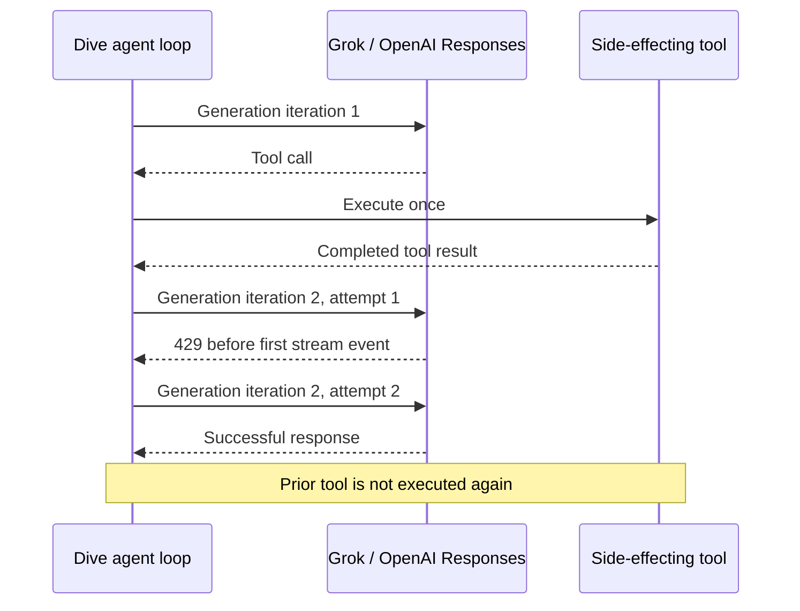

# Retry transient streaming generation failures before first event

**Workflow:** Standard-tier spec, Dive team feedback, then implementation.

## Context

Mobius runs each agent turn through one Dive `CreateResponse` call. A single
turn can therefore contain several model generations separated by tool calls:
the model requests tools, Dive executes them and appends their results, and the
next model generation continues from those results.

On 2026-07-14, an Omni production turn using Grok 4.5 completed several
side-effecting tools and then failed on a later model generation with:

```text
POST "https://api.x.ai/v1/responses": 429 Too Many Requests
"The service is temporarily at capacity. Please retry your request shortly."
```

The Mobius transcript proves that the earlier document operations, six memory
writes, two artifact writes, and their tool results were already durable before
the 429. Dive returned the generation error, so Mobius correctly settled the
turn as terminally failed. Reusing the turn's idempotency key returns that same
failed turn; starting a new turn asks the model to reconstruct the work and can
repeat completed external effects.

This happened at least three times in the Omni development project that day.
The clearest incident was turn `turn_01kxgqawxhfz19sycn88a3mxcs`, which ran for
63.6 seconds before the capacity error. A second turn failed with the same 429
after 30.9 seconds.

The important terminology distinction is:

- **Mid-turn:** the failure occurred in a later model iteration after earlier
  tools had completed.
- **Not necessarily mid-stream:** the failing provider request did not produce
  a usable response before returning the capacity error.

Retrying that one provider request inside the existing `CreateResponse` call is
safe. Retrying the whole agent turn is not.



## Current behavior and root cause

`Agent.generate` chooses `generateStreaming` for every `llm.StreamingLLM`.
That method consumes the iterator returned by the provider, publishes events,
and returns the iterator's final error. It intentionally does not know about
provider status codes or transport retry policy.

Before this change, streaming retries were inconsistent across the four
provider implementations and their adapters:

- OpenAI Responses and Google use lazy SDK iterators. Request failures can
  surface from the iterator only after `Stream` returns, so neither path had a
  provider retry boundary around a pre-event failure.
- Anthropic and OpenAI-compatible Chat Completions retried errors from the
  initial HTTP request, but stopped retrying once a `200 OK` body had been
  returned. A body read or parse failure before the first event therefore
  bypassed the same retry budget.
- Grok, Mistral, Ollama, and OpenRouter embed one of those providers. Their
  behavior depended on the embedded implementation, and most did not expose a
  provider-local `WithMaxRetries` option.

The result was an accidental contract mismatch: the same transient failure
could be retried or returned immediately based on provider family and on
whether it happened during HTTP setup or during the first iterator read.

## Goals

- Apply one pre-first-event retry contract to every Dive streaming provider:
  Anthropic, Google, OpenAI Responses, OpenAI-compatible Chat Completions,
  Grok, Mistral, Ollama, and OpenRouter.
- Use the existing `WithMaxRetries` budget and transient/permanent error
  classification: 429, 500, 502, 503, 504, 520, 529, and transport failures
  are retryable; invalid requests and authentication failures are not.
- Share one retry budget across stream creation and lazy iterator failures.
- Preserve all messages and completed tool results from earlier iterations in
  the same `CreateResponse` call.
- Never re-execute a tool merely because the following model generation was
  retried.
- Emit at most one visible stream for the successful attempt.
- Respect context cancellation and deadlines during requests and backoff.
- Keep the underlying OpenAI SDK retry count at zero so retry budgets do not
  multiply.

## Non-goals

- Restart or resurrect a `CreateResponse` call after it has returned an error.
- Resume a terminal Mobius turn.
- Recover an agent turn across a process crash.
- Retry a provider stream after any event has been emitted to the consumer.
- Reconcile or retract partial text, reasoning, or tool-call deltas.
- Retry the complete agent loop or replay already-completed tools.
- Change non-streaming retry behavior.

## Proposal

Add a shared provider-layer iterator decorator in the root `providers`
package. Each concrete provider builds the logical request and fires hooks
once, then supplies a factory that creates one fresh transport stream attempt.

The first call to the returned iterator's `Next()` owns the retry boundary:

1. Call the factory and ask the resulting provider iterator for its first
   event.
2. If an event is returned, mark the stream **committed** and expose it.
3. If stream creation fails, or the iterator stops with a transient error
   before an event, close the failed attempt, back off, and call the factory
   again.
4. Charge creation errors and iterator errors to the same `maxRetries + 1`
   attempt budget.
5. If the error is permanent, the context is cancelled, or the retry budget is
   exhausted, expose the final normalized error through `Err()`.
6. Once committed, delegate subsequent iteration directly. Any later error is
   returned without retry.

The commit point must be **the first event of any kind**, not merely the first
content-bearing delta. `response.created` becomes a Dive `message_start` event
and may already have reached callbacks or UI state. Retrying after that point
could expose two response IDs or duplicate lifecycle events even if no text was
generated.

The shared boundary has this shape:

```go
type StreamFactory func() (llm.StreamIterator, error)

type StreamRetryConfig struct {
    Provider       string
    MaxRetries     int
    RetryBaseWait  time.Duration
    Logger         llm.Logger
    NormalizeError func(error) error
}

func NewRetryingStreamIterator(
    ctx context.Context,
    config StreamRetryConfig,
    factory StreamFactory,
) llm.StreamIterator
```

Providers with SDK-specific error types supply `NormalizeError`; providers
that already return Dive provider errors do not need one:

- OpenAI Responses converts `*openai.Error` through `providers.NewError`.
- Google applies its existing `wrapGoogleError` conversion.
- Anthropic and Chat Completions return `providers.NewError` for non-200 HTTP
  responses and ordinary errors for transport or body failures.
- Treat transport failures as retryable unless the context was cancelled or
  its deadline expired.
- Preserve a useful final error for the caller; do not replace the provider
  error with a generic "retry exhausted" message.

Every `Provider.Stream` continues to build config and request parameters and
fires `llm.BeforeGenerate` once. Google is brought into that contract because
its streaming path previously omitted the hook. The transport-attempt factory
must not fire hooks or mutate caller-owned messages.

No change is required in the core agent loop. From
`Agent.generateStreaming`'s perspective, the provider returns one iterator and
one coherent event sequence. Earlier tool results remain in `updatedMessages`,
and Dive only executes tool calls after a model response has been accumulated,
so no tool from the failed pre-event attempt exists to execute.

### Configuration

Keep each base provider's existing default budget and backoff. Its
`WithMaxRetries(n)` option governs both `Generate` and `Stream` where both are
available. SDK-internal retries remain disabled where Dive already owns the
budget.

Add provider-local passthrough options for the adapters:

- `grok.WithMaxRetries` -> OpenAI Responses;
- `mistral.WithMaxRetries` and `openrouter.WithMaxRetries` -> OpenAI-compatible
  Chat Completions;
- `ollama.WithMaxRetries` -> Anthropic-compatible Messages.

The embedded base provider also receives the adapter's provider name so retry
logs identify Grok, Mistral, Ollama, or OpenRouter rather than the underlying
protocol implementation.

### Observability

Log each retry through the configured `llm.Config.Logger` with structured,
non-sensitive fields:

- provider name;
- attempt and maximum attempts;
- HTTP status when known;
- `before_first_event=true`;
- backoff duration.

Do not log prompts, response bodies, API keys, or tool results.

The existing Dive chat span can continue to represent one logical generation
iteration. HTTP instrumentation will show the individual attempts beneath it,
and time-to-first-content should include retry/backoff time because that is the
latency observed by the caller. No tracer API change is required.

## Safety invariants

The implementation should make these invariants explicit in comments and
tests:

1. A retry is allowed only before the first externally visible stream event.
2. A failed stream is closed before a replacement is created.
3. A committed stream is never replaced.
4. Provider retry does not call `CreateResponse`, `Agent.generate`, hooks, or
   tools again.
5. Cancellation and deadline errors stop retries immediately.
6. Total HTTP attempts equal `maxRetries + 1`; OpenAI SDK retries remain
   disabled.

## Tests

The shared helper has provider-independent coverage for:

1. First-attempt success and complete event passthrough.
2. One retry budget shared across factory errors, lazy iterator errors, and
   close errors, including exact exhaustion counts.
3. Permanent errors, normalized SDK errors, nil factories/streams, empty
   streams, and negative retry budgets.
4. No retry after the first event commits the stream.
5. Cancellation before the first attempt, cancellation from an attempt, and
   cancellation interrupting backoff.
6. Closing every failed attempt before replacement, closing a stream returned
   alongside a factory error, and idempotent caller close.
7. Structured status and transport-error logging without response bodies.

These tests execute every statement in `providers/retrying_stream.go` and do
not require a network or provider credential.

Provider-level `httptest` coverage verifies `429 -> success` wiring for
Anthropic, Google, OpenAI Responses, and OpenAI-compatible Chat Completions,
including a complete accumulated assistant response and one `BeforeGenerate`
hook invocation for the logical request. Injected response-body readers verify
that Anthropic and Chat Completions retry a connection failure after `200 OK`
but before the first event, close the failed body, and do not retry the same
failure after an event. OpenAI Responses separately injects pre-header and
post-event transport failures. Google verifies lazy permanent-error
classification and that a rejected hook starts no request.

OpenAI Responses additionally covers persistent 429, permanent 400, default
attempt budgets, and cancellation. The Google normalizer is tested with both
the value and pointer forms of `genai.APIError`; this caught and fixed a
pre-existing mismatch with the SDK's value-form errors. Grok, Mistral, Ollama,
and OpenRouter verify that `WithMaxRetries(1)` produces exactly two embedded
transport attempts and preserves the adapter provider name.

The end-to-end agent regression uses an `httptest` Responses endpoint:

- generation one returns a tool call;
- the tool increments a counter and returns successfully;
- the first HTTP attempt for generation two returns 429;
- its retry returns a final assistant response;
- `CreateResponse` succeeds and the tool counter remains exactly one.

That test is the strongest proof of the customer-visible contract: a later
generation can retry without replaying an earlier side effect.

## Alternatives considered

### Retry the entire `CreateResponse` call in Mobius

Rejected. A new call reconstructs the agent loop from durable history and can
repeat model-selected side effects. It also changes Mobius's terminal-turn
idempotency contract and turns a bounded provider failure into a distributed
recovery problem.

### Wrap `Agent.generateStreaming` in a generic retry loop

Rejected. That layer receives a `StreamingLLM`, not a transport-attempt
factory. Calling `Stream` again would replay provider hooks and request setup,
and providers that retain their own retry behavior could produce nested retry
budgets. It would also move provider-specific error normalization into the
agent loop. The correct reusable boundary is lower: inside provider `Stream`,
after one logical request is prepared but around creation and first iteration
of each transport stream.

### Retry after partial output

Deferred. After any event is visible, a retry needs an attempt/reset protocol
for callbacks, accumulators, response IDs, and UI previews. Without that
protocol, the consumer can receive duplicate text or tool-call fragments. The
reported xAI capacity failure does not require solving partial-stream replay.

### Enable the OpenAI SDK's built-in retries

Rejected. Dive deliberately disables them so `WithMaxRetries` is authoritative.
Re-enabling a second retry layer would multiply attempts and backoff, and it
would make OpenAI/Grok behave differently from the rest of Dive's provider
configuration.

## Tradeoffs and consequences

- The proposal fixes pre-event failures but deliberately still fails a stream
  that breaks after emitting an event. This is narrower than "retry every
  transient stream failure," but it has a clean no-duplication guarantee.
- Backoff increases time to first content during provider incidents. That is
  preferable to terminally failing a multi-tool turn and asking the caller to
  replay it.
- Stream setup errors from Anthropic and Chat Completions now follow the same
  lazy iterator contract as OpenAI Responses and Google: validation and hook
  errors can still be returned by `Stream`, while transport-attempt errors are
  reported by `Next`/`Err` after the shared retry budget is applied.
- A small amount of retry state is centralized in `providers`, which keeps
  policy identical without coupling the agent loop to provider transports.
- The provider may bill a failed attempt even when it produced no event. Dive
  cannot reliably recover usage for a request that never delivered usage data;
  this proposal does not attempt to synthesize it.

## Implementation

The implementation follows the shared provider-layer design:

- `providers/retrying_stream.go` owns the pre-first-event retry boundary,
  context-aware backoff, one shared attempt budget, failed-stream cleanup, and
  structured retry logging.
- Anthropic, Google, OpenAI Responses, and OpenAI-compatible Chat Completions
  build one logical request and give the helper a fresh-stream factory.
- OpenAI Responses and Google supply their SDK error normalizers.
- Google's normalizer handles both `genai.APIError` and `*genai.APIError`, so
  permanent SDK errors do not consume the transient retry budget.
- Grok, Mistral, Ollama, and OpenRouter expose `WithMaxRetries` and pass the
  configured budget and adapter name into their embedded provider.
- Provider SDK/internal retry layers remain disabled where Dive owns the
  budget, so total transport attempts remain `maxRetries + 1`.

No core agent-loop changes were needed.

## Validation

Focused tests cover the shared helper and every concrete provider surface:
recoverable and persistent 429s, permanent 400s, cancellation during backoff,
pre-header and post-`200 OK` transport failures, default attempt budgets,
failed-stream cleanup, the no-retry-after-first-event commit point, full normal
response accumulation, one-shot provider hooks, adapter names, retry-option
passthrough, and structured retry fields without provider response bodies.

The end-to-end agent regression runs two model generations around one tool
call. The second generation receives `429 -> success`; both attempts carry the
same request body and completed tool result, `CreateResponse` succeeds, and the
side-effect counter remains exactly one.

Build-tagged live streaming smoke tests also pass for OpenAI Responses and
Grok. The regular suite exercised available Anthropic and OpenAI-compatible
credentials. Providers without local credentials remain covered by
deterministic HTTP/SSE fixtures and injected transport failures, so retry
correctness does not depend on inducing a real provider outage.

## Rollout and verification

This is a backward-compatible behavioral fix and does not need a feature flag.

The implementation and local verification are complete. The remaining release
rollout is:

1. Release the root, Google, OpenAI, and Grok modules together. Anthropic,
   Chat Completions, Mistral, Ollama, and OpenRouter ship in the root module.
2. Update Mobius Cloud's Dive provider pins.
3. Exercise a synthetic `429 -> success` Grok turn in a non-production Mobius
   environment.
4. After production rollout, monitor terminal `generation_failed` turns whose
   provider error is 429/5xx and confirm retry logs precede either success or
   retry exhaustion.

Success means the synthetic multi-iteration test completes with one tool
execution, and the production class of pre-event xAI capacity errors no longer
terminalizes a turn until the configured provider retry budget has been
exhausted.

## Decisions

1. **Honor `Retry-After` in this change?** No. Preserve Dive's
   existing retry/backoff behavior for parity with `Generate`; add
   header-aware retry consistently across both paths in a separate change if
   needed.
2. **Generalize the pre-event wrapper across providers now?** Yes. Google is a
   second lazy-stream implementation, while Anthropic and Chat Completions had
   the same gap after a successful HTTP handshake but before their first
   event. A shared provider-layer helper gives all implementations one commit
   point and one retry budget without moving retries into the agent loop.
