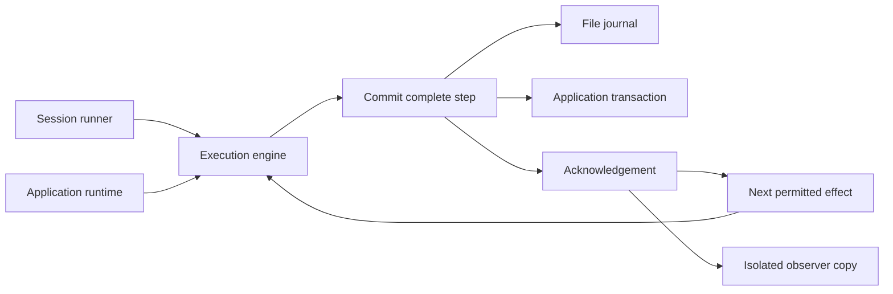

# Dive v2 execution prototypes

Disposable experiments for the [top recommendations](../../docs/design/2026-09-26-dive-v2-recommendations.md).
They do not change Dive's production API or call a provider. All names and wire
types are provisional.

```sh
go run ./experimental/v2/cmd/protocol-demo
go test -race ./experimental/v2/...
go test -race ./experimental/v2 -run TestRecoveryAcrossWorkerProcesses -v
```

## What runs

**Prototype 1: session-owned execution.** A small runner loads a turn from a file
journal, invokes the engine, and supplies its recorder. A scripted model calls a
local tool, requests an external tool, and returns a final answer. The demo opens
a fresh journal/runner while the external tool is pending, verifies that it stays
waiting, and accepts a result by its stable identity.

**Prototype 2: application-owned execution.** The same engine writes through a
simulated application transaction. Starting a turn consumes matching queued input
in the same critical section as recording it. Accepting a model result updates
token accounting in the same critical section. A connection error after commit
simulates a lost acknowledgement. Reload resumes from the committed result,
without repeating the model call or charging its usage twice.

**Recovery experiment: separate worker processes.** A local HTTP service hosts
simulated application storage and an idempotent effect ledger. Worker 1 commits a
simulated charge; the service closes the connection before replying. The worker
records uncertainty and exits. A coordinator hands ownership to worker 2, which
loads the pending call and looks up its receipt. The service then commits result
acceptance but drops that acknowledgement too. Redelivery is accepted without
starting another effect. An explicit continue finishes the turn; another result
redelivery remains harmless. Changed payloads and stale-owner writes are rejected.

This test starts real subprocesses and loses real HTTP responses. The parent
service and its in-memory database survive both workers. It tests worker restart,
not a database/service crash or a live payment integration.



## Protocol under test

Steps are versioned and identified by turn and sequence. Repeating an identical
step is accepted; reusing its identity for different content is rejected. Stores
validate sequence and transition order. Model and tool attempt identities persist
across invocations. Local tools receive `ToolInvocation.EffectID` explicitly, so
they can pass it downstream as an idempotency key. The limit counts model attempts
across the entire turn.

The engine acknowledges an intent before invoking an effect and acknowledges its
result before advancing. Tool arguments are transformed, validated as JSON, and
explicitly authorized before the effective call is recorded. Authorization,
execution, recording, and observation receive the same effective arguments.

An unresolved intent loaded from storage means **may have executed**. Rehydration
does not invoke it. The owner must reconcile and supply a result. A declared
external tool instead returns `waiting` and requires explicit result acceptance;
the engine does not dispatch it. The host must give its worker the stable effect
identity and reconcile dispatch/retry separately.

Tool results explicitly declare `succeeded`, `failed`, `not_executed`, or `unknown`.
A transport/Go error always records `tool_uncertain` and retains the pending call,
even if the tool also supplied a claimed result. Definite failures/nonexecution
must be returned as a typed result with nil Go error. Invalid result states are
conservatively unknown. Reconciliation can later accept a verified definite
result. This fixes the first independent review's timeout-after-success finding.

Result acceptance requires a `CommandID`. Repeating that identity with identical
content returns `Duplicate: true` and `Reason: duplicate`, including after the
turn completes. It neither appends a record nor advances execution. Reload then
send an empty command to continue after an ambiguous acknowledgement. Reusing the
command identity with different content is rejected. A new command identity for
an already settled effect is also rejected; senders must retain delivery IDs.

`Outcome.Records` is the last acknowledged state. On a write failure,
`Unacknowledged` contains the attempted transition, including any observed result,
and `WriteError` distinguishes a guaranteed rejection from an unknown commit.
Ordinary recorder errors default to unknown. A failed terminal write never
appears as durable completion. Reload after unknown acknowledgement before making
another execution decision. This is not an exactly-once effects guarantee.

Observers and model request history receive independent copies. Usage is recorded
even for empty/refused/failed responses. Nil usage means unknown, while an allocated
zero value means known zero. Observed results get a cancellation-independent write
context with a two-second deadline; implementations must cooperate with that
context (it does not interrupt filesystem calls or mutex waits). The recorder
still owns fencing checks.

## Evidence and limits

On 2026-09-26, `go test -race ./experimental/v2/...`,
`go vet ./experimental/v2/...`, and the demo above passed locally.
The demo completed both flows with three model calls. After losing the first
model-result acknowledgement, the application flow resumed without repeating
that call; replaying all commits left usage at 30 input / 6 output tokens.

The main design finding is that a single recording seam can support both owners,
but the acknowledgement contract is inseparable from recovery. A caller needs
the unacknowledged observation, the ability to reload, and an explicit result
acceptance command. A callback that merely reports progress cannot replace that
contract. The second experiment extends that result: uncertain tool observations
must remain distinct from accepted results, tool identity must reach the downstream
service, and redelivering a result must not implicitly advance execution.

The tests exercise rejection and lost acknowledgement at every step of a two-call
turn, recovery without repeating pending effects, explicit acceptance of observed
but rejected results, terminal-write failure, file reopen, external resume, limits
across resume, input retention, input rewrites, observer mutation, transaction
rollback, idempotent metering, refusals, partial errors, unknown usage, and saving
an observed result after cancellation. They also reject invalid record sequences
and execution without an explicit authorization policy. New tests cover every
tool certainty state, transport failure after a side effect, real worker-process
handoff, lost result-acceptance acknowledgement, repeated/conflicting commands,
downstream idempotency, and takeover while an old tool is still running.

These experiments establish a usable separation between engine and recording
owner. They are **not production durability or integration proof**:

- The session runner handles one turn. It has no multi-turn projection, claims,
  compaction, forks, or migration adapter for today's session format.
- The file journal uses full JSON snapshots with file sync, atomic replacement,
  and directory sync. It is deliberately inefficient and requires a single
  writer. Tests reopen files; they do not simulate process kills or power loss.
  Reuse the existing session store's tested recovery and claims in production.
- The host transaction is a mutex-protected simulation, not a SQL integration.
  It meters tokens, not prices or spend authorization. `Takeover` and `OwnerStore`
  simulate monotonically increasing fencing tokens, checked atomically with each
  write (including duplicate writes). They do not implement lease expiry or
  acquisition policy. A real adapter still needs transactional revisions,
  leases, input identities, and budget admission.
- Commit deduplication alone cannot prevent two engine owners from executing the
  same acknowledged intent. The runner serializes one instance; applications
  must enforce one owner per turn. The recovery test explicitly invalidates old
  owners and fences the downstream service too. Its coordinated handoff is a simulation: real downstream services
  must support idempotency/fencing or require an outbox/reconciliation strategy.
  The file journal still has no cross-process ownership protection.
- Only text and one tool per model result are supported. External/local tool
  routing comes from scripted data. Real tools need trusted registry resolution,
  complete schema validation, typed policy decisions, and bounded concurrency.
- There is no streaming, provider adapter, private replay data, dynamic input,
  provider pause, or general retry/reconciliation policy. The model receives step
  records, not a provider-ready conversation projection.
- Cancellation between effects returns an invocation outcome without closing the
  turn. Cancellation returned as a model error currently closes as `failed`; a tool
  error retains uncertainty for reconciliation.
  Direct `Engine.Execute` calls can accept an already-canceled start and consume
  queued input because all commits currently use the cancellation-independent
  context. The session runner checks cancellation during load. Command acceptance
  semantics need a deliberate choice before these interfaces are frozen.
  Policy/validation errors return Go errors with the acknowledged records. These
  are deliberate remaining outcome-design questions, not final v2 semantics.
- Copying/replaying the full history on every commit is expensive. Observers run
  synchronously and can block or panic. Only value isolation is established;
  throughput, bounded display-event delivery, and retention need another spike.

The next experiment should port one real consumer workflow through these
contracts and exercise real provider request preparation. Expand the recording
protocol only when those cases demand it; do not copy this package wholesale into Dive's public API.

## Second independent review

On 2026-09-26, the independent reviewer confirmed both original findings were
fixed: local tools receive their effect IDs, and transport errors leave effects
open for reconciliation. They found no new blocking correctness issue within
the documented single-owner and adapter assumptions. Their uncached race tests
and vet passed. An additional scratch probe canceled the actual invocation
context after a successful simulated side effect; uncertainty persisted, a new
owner reconciled it, and repeating the result caused no additional effect.

The review identified three remaining validation/design priorities:

1. Kill a worker after the side effect but before it can record uncertainty. The
   current subprocess test exits normally after recording uncertainty; it does
   not prove this narrower crash boundary.
2. Port a representative consumer flow and exercise actual provider preparation,
   leases, and downstream idempotency instead of extending the simulation alone.
3. Decide whether a canceled start may still accept input, as described above.

The evidence supports continuing with the shared-engine direction. It does not
freeze a production API or replace real storage and provider qualification.
